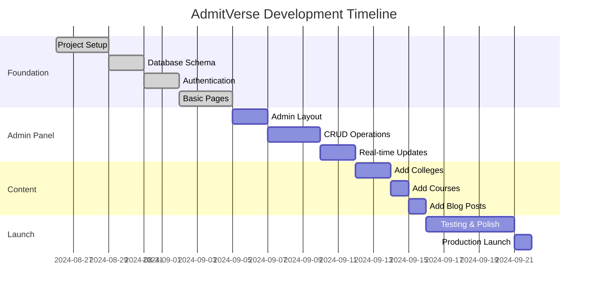

# Admin Panel Development Sequence
## When to Build Admin Panel vs Website Structure

**Document Version:** 1.0  
**Date:** August 26, 2024  
**Purpose:** Clear timeline for admin panel development in relation to website structure

---

## 🎯 Quick Answer

**Build the admin panel AFTER the basic website structure but BEFORE adding real content.**

Here's the optimal sequence:

```
1. Website Foundation (Week 1-2) → Basic structure, homepage, auth
2. Database & APIs (Week 2-3) → Core functionality
3. Admin Panel (Week 3-4) → Content management system  
4. Content Addition (Week 4-5) → Use admin to add colleges/courses
5. Polish & Launch (Week 5-8) → Final features and testing
```

---

## 📅 Detailed Development Sequence

### **Phase 1: Website Foundation First (Week 1-2)**

**Why Foundation First?**
- You need the database schema before admin panel
- API routes must exist before admin can use them
- Authentication system needed for admin access

**Build These First:**
```bash
✅ Basic website structure (/src/app/)
✅ Database schema (Prisma)
✅ Authentication system (NextAuth)
✅ Basic API routes (tRPC)
✅ Core components (UI library)
✅ Homepage with static content
```

**Example Timeline:**
- **Day 1-3:** Project setup, database, auth
- **Day 4-7:** Basic pages, components
- **Day 8-10:** API routes, search functionality
- **Day 11-14:** Homepage with dummy data

### **Phase 2: Admin Panel Development (Week 3-4)**

**Why Admin Panel at This Stage?**
- Database and APIs are ready
- You need to add real content efficiently
- Testing admin functionality early prevents issues

**Build Admin Panel Now:**
```bash
✅ Admin authentication and roles
✅ College management (CRUD)
✅ Course management (CRUD)
✅ Blog post management
✅ Image upload system
✅ Real-time updates
```

### **Phase 3: Content Population (Week 4-5)**

**Use Admin Panel to Add Content:**
```bash
✅ Add 10-15 colleges via admin panel
✅ Add 50+ courses via admin panel
✅ Create blog posts via admin panel
✅ Upload images via admin panel
✅ Test real-time updates
```

---

## 🚫 What NOT to Do

### **❌ Wrong Sequence 1: Admin Panel Too Early**
```bash
Week 1: Build admin panel first
❌ Problem: No database schema exists
❌ Problem: No API routes to connect to
❌ Problem: No authentication system
❌ Result: Admin panel has nothing to manage
```

### **❌ Wrong Sequence 2: Admin Panel Too Late**
```bash
Week 1-4: Build entire website with hard-coded data
Week 5: Try to build admin panel
❌ Problem: Too much manual work already done
❌ Problem: Hard to retrofit admin functionality
❌ Problem: Database structure might need changes
❌ Result: Rush job, poor admin experience
```

### **❌ Wrong Sequence 3: No Admin Panel**
```bash
Add content manually via database/SQL
❌ Problem: Time-consuming to add content
❌ Problem: Non-technical team members can't help
❌ Problem: No way to update content after launch
❌ Result: Maintenance nightmare
```

---

## ✅ Correct Development Flow

### **Week 1-2: Foundation**

**Step 1: Database Schema**
```typescript
// Define your data structure first
model College {
  id          String @id @default(uuid())
  name        String
  slug        String @unique
  description String?
  // ... other fields
}
```

**Step 2: Basic API Routes**
```typescript
// Create API endpoints
export const collegeRouter = createTRPCRouter({
  getAll: publicProcedure.query(...),
  getBySlug: publicProcedure.query(...),
  create: adminProcedure.mutation(...),    // For admin panel
  update: adminProcedure.mutation(...),    // For admin panel
  delete: adminProcedure.mutation(...),    // For admin panel
})
```

**Step 3: Authentication**
```typescript
// Set up user roles
export const authOptions = {
  // ... auth config with roles
  callbacks: {
    session: async ({ session, token }) => {
      session.user.role = token.role // admin, user, etc.
      return session
    }
  }
}
```

**Step 4: Basic Pages**
```typescript
// Create basic pages with dummy data
export default function HomePage() {
  return (
    <div>
      <HeroSection />
      <FeaturedColleges data={DUMMY_COLLEGES} />
    </div>
  )
}
```

### **Week 3: Admin Panel Development**

**Step 5: Admin Layout**
```typescript
// Create admin-specific layout
export default function AdminLayout({ children }) {
  return (
    <div className="admin-layout">
      <AdminSidebar />
      <main>{children}</main>
    </div>
  )
}
```

**Step 6: CRUD Operations**
```typescript
// Build college management
export default function AdminCollegesPage() {
  // List, create, edit, delete colleges
  return <CollegeManagement />
}
```

**Step 7: Real-time Updates**
```typescript
// Connect admin changes to website
useEffect(() => {
  const subscription = supabase
    .channel('colleges')
    .on('postgres_changes', { event: '*', schema: 'public', table: 'colleges' }, 
      (payload) => {
        // Update website in real-time
        queryClient.invalidateQueries(['colleges'])
      })
    .subscribe()
}, [])
```

### **Week 4: Content Population**

**Step 8: Add Real Content**
```bash
# Use admin panel to add:
- 15 colleges with full details
- 50+ courses across all colleges  
- 10+ blog posts
- All images and media
```

**Step 9: Replace Dummy Data**
```typescript
// Replace static data with API calls
export default function HomePage() {
  const { data: colleges } = api.college.getFeatured.useQuery()
  
  return (
    <div>
      <HeroSection />
      <FeaturedColleges data={colleges} /> {/* Real data now! */}
    </div>
  )
}
```

---

## 📊 Benefits of This Sequence

### **1. Efficient Content Management**
- Add 50 colleges in 2 hours via admin panel
- vs 2 days manually editing database

### **2. Team Collaboration**
- Technical team builds foundation
- Content team uses admin panel to add data
- Parallel work increases speed

### **3. Easy Testing**
- Test admin functionality with real use cases
- Catch bugs before launch
- Iterate on admin UI/UX

### **4. Future-Proof**
- Easy to add new colleges after launch
- Non-technical users can manage content
- Scales to hundreds of colleges

---

## 🎯 Implementation Checklist

### **Before Building Admin Panel:**
- [ ] Database schema finalized
- [ ] Basic API routes working
- [ ] Authentication system implemented
- [ ] User roles defined (admin, user)
- [ ] Basic website pages created
- [ ] Core components built

### **Admin Panel Development:**
- [ ] Admin layout and navigation
- [ ] College CRUD operations
- [ ] Course CRUD operations
- [ ] Blog post CRUD operations
- [ ] Image upload functionality
- [ ] Real-time updates working
- [ ] Admin-only API routes secured

### **After Admin Panel:**
- [ ] Populate content via admin panel
- [ ] Test all admin functionality
- [ ] Replace dummy data with real data
- [ ] Train content team on admin panel
- [ ] Set up content workflows

---

## 🚨 Common Mistakes to Avoid

### **Mistake 1: Building Admin Panel Too Early**
**Problem:** No foundation to build upon
**Solution:** Build database and API first

### **Mistake 2: Building Admin Panel Too Late**
**Problem:** Manual content management becomes overwhelming
**Solution:** Build admin panel by Week 3

### **Mistake 3: Skipping Admin Panel**
**Problem:** No way to manage content efficiently
**Solution:** Always include admin panel for dynamic sites

### **Mistake 4: Building Admin Panel Separately**
**Problem:** Admin panel doesn't integrate with main site
**Solution:** Build admin panel as part of main project

---

## 📈 Development Timeline Summary



---

## 🎯 Key Takeaways

1. **Build Foundation First** - Database, APIs, auth, basic pages
2. **Admin Panel in Week 3** - After foundation, before heavy content work
3. **Use Admin Panel for Content** - Don't manually add data
4. **Test Early** - Admin panel bugs are easier to fix early
5. **Train Team** - Make sure content team knows how to use admin

**Remember:** The admin panel is a **tool** that makes content management efficient. Build the foundation first, then build the tool, then use the tool to populate content efficiently! 🚀

---

## 📞 Next Steps

1. **Follow GETTING_STARTED_FROM_ZERO.md** for foundation setup
2. **Use TECHNICAL_IMPLEMENTATION_GUIDE.md** for detailed coding
3. **Build admin panel in Week 3** using ADMIN_PANEL_REALTIME_GUIDE.md
4. **Populate content via admin panel** in Week 4
5. **Launch with real data** in Week 8

This sequence ensures you build efficiently and have a powerful content management system ready when you need it!