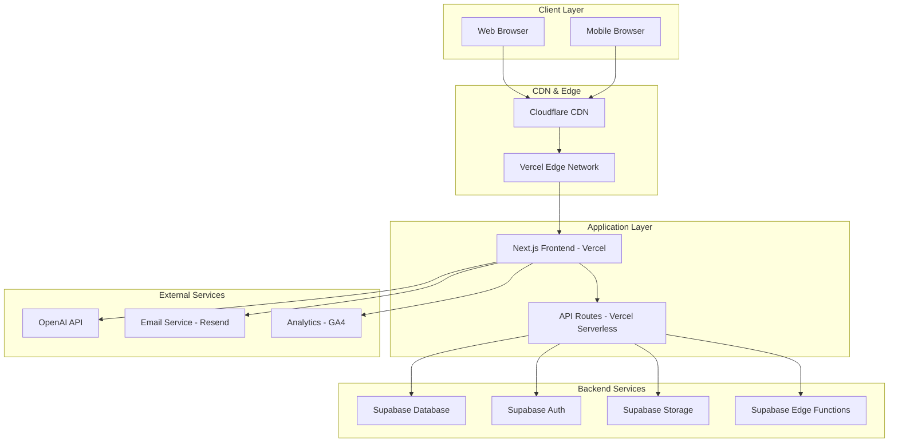

# Deployment & DevOps Strategy
## AdmitVerse - International Education Platform

**Document Version:** 1.0  
**Date:** August 26, 2024  
**Owner:** CTPO  
**Status:** Draft

---

## Table of Contents

1. [Executive Summary](#executive-summary)
2. [Infrastructure Architecture](#infrastructure-architecture)
3. [CI/CD Pipeline](#cicd-pipeline)
4. [Environment Strategy](#environment-strategy)
5. [Deployment Procedures](#deployment-procedures)
6. [Monitoring & Observability](#monitoring--observability)
7. [Security & Compliance](#security--compliance)
8. [Backup & Disaster Recovery](#backup--disaster-recovery)
9. [Scaling Strategy](#scaling-strategy)
10. [Operational Procedures](#operational-procedures)

---

## 1. Executive Summary

### 🎯 DevOps Philosophy
AdmitVerse will implement a modern, cloud-native DevOps strategy focused on:
- **Automation First**: Fully automated CI/CD pipelines
- **Infrastructure as Code**: Version-controlled infrastructure
- **Observability**: Comprehensive monitoring and logging
- **Security**: Security integrated into every step
- **Reliability**: 99.9% uptime target with robust disaster recovery

### 🏗️ Technology Stack
- **Frontend Hosting:** Vercel (Next.js optimized)
- **Backend Services:** Supabase Cloud
- **Database:** PostgreSQL on Supabase
- **CDN:** Vercel Edge Network + Cloudflare
- **Monitoring:** Datadog + Sentry
- **CI/CD:** GitHub Actions
- **Infrastructure:** Terraform (Infrastructure as Code)

---

## 2. Infrastructure Architecture

### 🌐 High-Level Architecture



### 🏛️ Infrastructure Components

#### Frontend Infrastructure (Vercel)
```yaml
# vercel.json
{
  "version": 2,
  "builds": [
    {
      "src": "package.json",
      "use": "@vercel/next"
    }
  ],
  "routes": [
    {
      "src": "/api/(.*)",
      "dest": "/api/$1"
    },
    {
      "src": "/(.*)",
      "dest": "/$1"
    }
  ],
  "env": {
    "NEXT_PUBLIC_SUPABASE_URL": "@supabase-url",
    "NEXT_PUBLIC_SUPABASE_ANON_KEY": "@supabase-anon-key",
    "OPENAI_API_KEY": "@openai-api-key"
  },
  "regions": ["bom1", "sin1", "syd1", "hnd1"],
  "functions": {
    "app/api/**/*": {
      "maxDuration": 30
    }
  }
}
```

#### Database Infrastructure (Supabase)
```sql
-- Database configuration
-- Connection pooling: PgBouncer (transaction mode)
-- Max connections: 100
-- Connection timeout: 30 seconds
-- Statement timeout: 60 seconds

-- Row Level Security policies
CREATE POLICY "Users can view published colleges" ON colleges
  FOR SELECT USING (status = 'published');

CREATE POLICY "Admins can manage all colleges" ON colleges
  FOR ALL USING (auth.role() = 'admin');

-- Performance indexes
CREATE INDEX CONCURRENTLY idx_colleges_search 
ON colleges USING GIN(to_tsvector('english', name || ' ' || description));

CREATE INDEX CONCURRENTLY idx_colleges_location 
ON colleges (country, city);

CREATE INDEX CONCURRENTLY idx_courses_college_id 
ON courses (college_id);
```

### 🌍 Global Distribution Strategy

#### CDN Configuration
```typescript
// CDN cache configuration
const cacheConfig = {
  // Static assets
  '/_next/static/*': {
    headers: {
      'Cache-Control': 'public, max-age=31536000, immutable'
    }
  },
  
  // API responses
  '/api/colleges': {
    headers: {
      'Cache-Control': 'public, s-maxage=300, stale-while-revalidate=600'
    }
  },
  
  // HTML pages
  '/colleges/*': {
    headers: {
      'Cache-Control': 'public, s-maxage=60, stale-while-revalidate=300'
    }
  }
};
```

#### Edge Locations
- **Primary:** Singapore, Mumbai, Sydney (Asia-Pacific)
- **Secondary:** London, Frankfurt (Europe)
- **Tertiary:** US East, US West (Americas)

---

## 3. CI/CD Pipeline

### 🔄 GitHub Actions Workflow

#### Main Workflow: `.github/workflows/main.yml`
```yaml
name: CI/CD Pipeline
on:
  push:
    branches: [main, develop]
  pull_request:
    branches: [main]

jobs:
  test:
    runs-on: ubuntu-latest
    steps:
      - uses: actions/checkout@v4
      - name: Setup Node.js
        uses: actions/setup-node@v4
        with:
          node-version: '18'
          cache: 'npm'
      
      - name: Install dependencies
        run: npm ci
      
      - name: Run linting
        run: npm run lint
      
      - name: Run type checking
        run: npm run type-check
      
      - name: Run unit tests
        run: npm run test:unit
      
      - name: Run integration tests
        run: npm run test:integration
        env:
          SUPABASE_URL: ${{ secrets.SUPABASE_URL_TEST }}
          SUPABASE_KEY: ${{ secrets.SUPABASE_KEY_TEST }}
      
      - name: Run E2E tests
        run: npm run test:e2e
        env:
          PLAYWRIGHT_BROWSERS_PATH: 0
      
      - name: Upload coverage reports
        uses: codecov/codecov-action@v3

  security-scan:
    runs-on: ubuntu-latest
    steps:
      - uses: actions/checkout@v4
      - name: Run Trivy vulnerability scanner
        uses: aquasecurity/trivy-action@master
        with:
          scan-type: 'fs'
          format: 'sarif'
          output: 'trivy-results.sarif'
      
      - name: Upload Trivy scan results
        uses: github/codeql-action/upload-sarif@v2
        with:
          sarif_file: 'trivy-results.sarif'

  build-and-deploy:
    needs: [test, security-scan]
    runs-on: ubuntu-latest
    if: github.ref == 'refs/heads/main'
    steps:
      - uses: actions/checkout@v4
      
      - name: Deploy to Vercel
        uses: amondnet/vercel-action@v25
        with:
          vercel-token: ${{ secrets.VERCEL_TOKEN }}
          vercel-org-id: ${{ secrets.ORG_ID }}
          vercel-project-id: ${{ secrets.PROJECT_ID }}
          vercel-args: '--prod'
      
      - name: Run database migrations
        run: |
          npx supabase db push --db-url ${{ secrets.DATABASE_URL }}
        env:
          SUPABASE_ACCESS_TOKEN: ${{ secrets.SUPABASE_ACCESS_TOKEN }}
      
      - name: Notify deployment
        uses: 8398a7/action-slack@v3
        with:
          status: ${{ job.status }}
          webhook_url: ${{ secrets.SLACK_WEBHOOK }}
```

#### Preview Deployments
```yaml
name: Preview Deployment
on:
  pull_request:
    types: [opened, synchronize]

jobs:
  deploy-preview:
    runs-on: ubuntu-latest
    steps:
      - uses: actions/checkout@v4
      
      - name: Deploy to Vercel (Preview)
        uses: amondnet/vercel-action@v25
        id: vercel-deploy
        with:
          vercel-token: ${{ secrets.VERCEL_TOKEN }}
          vercel-org-id: ${{ secrets.ORG_ID }}
          vercel-project-id: ${{ secrets.PROJECT_ID }}
      
      - name: Comment PR with preview URL
        uses: actions/github-script@v6
        with:
          script: |
            github.rest.issues.createComment({
              issue_number: context.issue.number,
              owner: context.repo.owner,
              repo: context.repo.repo,
              body: '🚀 Preview deployment ready: ${{ steps.vercel-deploy.outputs.preview-url }}'
            })
```

### 📊 Pipeline Metrics & Quality Gates

#### Quality Gates Configuration
```yaml
# .github/workflows/quality-gates.yml
quality_gates:
  code_coverage:
    threshold: 80%
    fail_on_decrease: true
  
  performance:
    lighthouse_score: 90
    bundle_size_limit: "500kb"
  
  security:
    vulnerability_threshold: "medium"
    dependency_check: true
  
  accessibility:
    axe_violations: 0
    wcag_level: "AA"
```

---

## 4. Environment Strategy

### 🌍 Environment Configuration

#### Environment Hierarchy
1. **Development** - Local development
2. **Testing** - Automated testing environment
3. **Staging** - Pre-production testing
4. **Production** - Live production environment

#### Environment Variables Management
```bash
# Production Environment (.env.production)
# Database
NEXT_PUBLIC_SUPABASE_URL=https://prod.supabase.co
SUPABASE_SERVICE_ROLE_KEY=****
DATABASE_URL=postgresql://****

# External APIs
OPENAI_API_KEY=****
RESEND_API_KEY=****

# Analytics
NEXT_PUBLIC_GA_ID=G-****
NEXT_PUBLIC_HOTJAR_ID=****

# Security
NEXTAUTH_SECRET=****
NEXTAUTH_URL=https://admitverse.com

# Features flags
FEATURE_AI_RECOMMENDATIONS=true
FEATURE_COLLEGE_COMPARISON=true

# Performance
VERCEL_ANALYTICS_ID=****
```

### 🔧 Feature Flags Implementation

#### Feature Flag Configuration
```typescript
// lib/feature-flags.ts
import { unstable_flag as flag } from '@vercel/flags/next';

export const showAIRecommendations = flag({
  key: 'ai-recommendations',
  decide: () => process.env.FEATURE_AI_RECOMMENDATIONS === 'true',
});

export const enableCollegeComparison = flag({
  key: 'college-comparison', 
  decide: () => process.env.FEATURE_COLLEGE_COMPARISON === 'true',
});

// Usage in components
export default function RecommendationsSection() {
  const showAI = showAIRecommendations();
  
  return (
    <div>
      {showAI && <AIRecommendations />}
      <StandardRecommendations />
    </div>
  );
}
```

---

## 5. Deployment Procedures

### 🚀 Deployment Strategies

#### Blue-Green Deployment (Vercel)
```yaml
# Deployment configuration
deployment:
  strategy: blue-green
  
  production:
    domain: admitverse.com
    alias: [www.admitverse.com]
    
  staging:
    domain: staging.admitverse.com
    
  preview:
    domain: "[branch].admitverse.dev"
```

#### Database Migrations Strategy
```sql
-- Migration versioning system
CREATE TABLE schema_migrations (
  version VARCHAR(255) PRIMARY KEY,
  applied_at TIMESTAMP DEFAULT CURRENT_TIMESTAMP,
  applied_by VARCHAR(255)
);

-- Example migration: 20240826_001_add_college_rankings.sql
BEGIN;

-- Add new column
ALTER TABLE colleges 
ADD COLUMN world_ranking INTEGER,
ADD COLUMN country_ranking INTEGER;

-- Create index
CREATE INDEX idx_colleges_world_ranking ON colleges (world_ranking);

-- Update schema version
INSERT INTO schema_migrations (version, applied_by) 
VALUES ('20240826_001', 'automated-deployment');

COMMIT;
```

### 📋 Deployment Checklist

#### Pre-Deployment
- [ ] All tests passing (unit, integration, e2e)
- [ ] Security scan passed
- [ ] Performance benchmarks met
- [ ] Database migration scripts ready
- [ ] Feature flags configured
- [ ] Rollback plan prepared
- [ ] Monitoring alerts configured

#### Deployment Process
1. **Preparation Phase**
   - Tag release version
   - Prepare rollback artifacts
   - Notify stakeholders

2. **Deployment Phase**
   - Deploy to staging environment
   - Run smoke tests
   - Deploy to production
   - Run health checks

3. **Verification Phase**
   - Monitor key metrics
   - Verify functionality
   - Check error rates
   - Confirm user experience

4. **Post-Deployment**
   - Update documentation
   - Close deployment tickets
   - Schedule post-deployment review

---

## 6. Monitoring & Observability

### 📊 Monitoring Stack

#### Application Performance Monitoring (APM)
```typescript
// instrumentation.ts - OpenTelemetry setup
export async function register() {
  if (process.env.NEXT_RUNTIME === 'nodejs') {
    const { NodeSDK } = await import('@opentelemetry/sdk-node');
    const { getNodeAutoInstrumentations } = await import('@opentelemetry/auto-instrumentations-node');
    const { Resource } = await import('@opentelemetry/resources');
    const { SemanticResourceAttributes } = await import('@opentelemetry/semantic-conventions');

    const sdk = new NodeSDK({
      resource: new Resource({
        [SemanticResourceAttributes.SERVICE_NAME]: 'admitverse-app',
        [SemanticResourceAttributes.SERVICE_VERSION]: process.env.VERCEL_GIT_COMMIT_SHA,
      }),
      instrumentations: [getNodeAutoInstrumentations()],
    });

    sdk.start();
  }
}
```

#### Error Tracking (Sentry)
```typescript
// sentry.client.config.ts
import * as Sentry from '@sentry/nextjs';

Sentry.init({
  dsn: process.env.NEXT_PUBLIC_SENTRY_DSN,
  
  // Performance Monitoring
  tracesSampleRate: 0.1,
  
  // Release tracking
  release: process.env.VERCEL_GIT_COMMIT_SHA,
  
  // Environment
  environment: process.env.NODE_ENV,
  
  // Custom error filtering
  beforeSend(event) {
    // Filter out known issues
    if (event.exception?.values?.[0]?.type === 'ChunkLoadError') {
      return null;
    }
    return event;
  },
  
  // Performance monitoring
  integrations: [
    new Sentry.BrowserTracing({
      tracingOrigins: ['localhost', 'admitverse.com', /^\//],
    }),
  ],
});
```

### 📈 Key Metrics & Dashboards

#### Business Metrics Dashboard
```yaml
dashboard: "AdmitVerse - Business Metrics"
metrics:
  user_engagement:
    - monthly_active_users
    - session_duration
    - pages_per_session
    - bounce_rate
  
  lead_generation:
    - conversion_rate
    - leads_per_day
    - cost_per_lead
    - lead_quality_score
  
  content_performance:
    - blog_views
    - college_page_views
    - search_queries
    - popular_colleges
```

#### Technical Metrics Dashboard
```yaml
dashboard: "AdmitVerse - Technical Metrics"
metrics:
  performance:
    - core_web_vitals (LCP, FID, CLS)
    - page_load_time
    - api_response_time
    - database_query_time
  
  reliability:
    - uptime_percentage
    - error_rate
    - 5xx_errors
    - failed_requests
  
  infrastructure:
    - cdn_cache_hit_rate
    - database_connections
    - memory_usage
    - cpu_utilization
```

### 🚨 Alerting Strategy

#### Alert Configuration
```yaml
# alerts.yml
alerts:
  critical:
    - name: "High Error Rate"
      condition: "error_rate > 5%"
      duration: "5m"
      channels: ["pagerduty", "slack"]
    
    - name: "Database Down"
      condition: "database_connectivity == false"
      duration: "1m"
      channels: ["pagerduty", "phone"]
  
  warning:
    - name: "Slow Response Time"
      condition: "avg_response_time > 2s"
      duration: "10m"
      channels: ["slack"]
    
    - name: "Low Conversion Rate"
      condition: "conversion_rate < 10%"
      duration: "1h"
      channels: ["email", "slack"]

notification_channels:
  slack:
    webhook: "${SLACK_WEBHOOK_URL}"
    channel: "#alerts-prod"
  
  pagerduty:
    integration_key: "${PAGERDUTY_KEY}"
  
  email:
    recipients: ["ops@admitverse.com", "cto@admitverse.com"]
```

---

## 7. Security & Compliance

### 🔒 Security Architecture

#### Security Headers Configuration
```typescript
// next.config.js security headers
const securityHeaders = [
  {
    key: 'X-DNS-Prefetch-Control',
    value: 'on'
  },
  {
    key: 'Strict-Transport-Security',
    value: 'max-age=63072000; includeSubDomains; preload'
  },
  {
    key: 'X-Frame-Options',
    value: 'DENY'
  },
  {
    key: 'X-Content-Type-Options',
    value: 'nosniff'
  },
  {
    key: 'Referrer-Policy',
    value: 'origin-when-cross-origin'
  },
  {
    key: 'Content-Security-Policy',
    value: [
      "default-src 'self'",
      "script-src 'self' 'unsafe-eval' 'unsafe-inline' *.vercel-insights.com",
      "style-src 'self' 'unsafe-inline'",
      "img-src 'self' blob: data: https:",
      "connect-src 'self' *.supabase.co wss://*.supabase.co",
    ].join('; ')
  }
];
```

#### API Security Implementation
```typescript
// middleware.ts - API security
import { createMiddlewareClient } from '@supabase/auth-helpers-nextjs';
import { NextResponse } from 'next/server';
import type { NextRequest } from 'next/server';

export async function middleware(req: NextRequest) {
  // Rate limiting
  const ip = req.ip ?? '127.0.0.1';
  const rateLimitResult = await rateLimit(ip);
  
  if (!rateLimitResult.success) {
    return new NextResponse('Too Many Requests', { status: 429 });
  }

  // API key validation for external APIs
  if (req.nextUrl.pathname.startsWith('/api/external/')) {
    const apiKey = req.headers.get('X-API-Key');
    const isValidKey = await validateApiKey(apiKey);
    
    if (!isValidKey) {
      return new NextResponse('Unauthorized', { status: 401 });
    }
  }

  // Authentication for protected routes
  if (req.nextUrl.pathname.startsWith('/admin/')) {
    const res = NextResponse.next();
    const supabase = createMiddlewareClient({ req, res });
    const { data: { session } } = await supabase.auth.getSession();
    
    if (!session) {
      return NextResponse.redirect(new URL('/login', req.url));
    }
  }

  return NextResponse.next();
}
```

### 🛡️ Data Protection

#### Personal Data Handling
```sql
-- Data retention policies
CREATE TABLE data_retention_policies (
  table_name VARCHAR(255),
  retention_days INTEGER,
  cleanup_query TEXT,
  last_cleanup TIMESTAMP
);

-- Example: Cleanup old user sessions
INSERT INTO data_retention_policies VALUES
('user_sessions', 30, 'DELETE FROM user_sessions WHERE created_at < NOW() - INTERVAL ''30 days''', NULL);

-- Audit logging
CREATE TABLE audit_logs (
  id UUID PRIMARY KEY DEFAULT gen_random_uuid(),
  table_name VARCHAR(255),
  operation VARCHAR(50),
  user_id UUID,
  old_values JSONB,
  new_values JSONB,
  created_at TIMESTAMP DEFAULT CURRENT_TIMESTAMP
);
```

#### GDPR Compliance Implementation
```typescript
// lib/gdpr-compliance.ts
export class GDPRCompliance {
  static async handleDataDeletion(userId: string) {
    const supabase = createClient();
    
    // Delete personal data
    await Promise.all([
      supabase.from('user_profiles').delete().eq('user_id', userId),
      supabase.from('user_preferences').delete().eq('user_id', userId),
      supabase.from('saved_colleges').delete().eq('user_id', userId),
      supabase.from('lead_submissions').update({ 
        email: 'deleted@privacy.local',
        name: '[DELETED]',
        phone: '[DELETED]'
      }).eq('user_id', userId),
    ]);
    
    // Log the deletion
    await this.logDataDeletion(userId);
  }
  
  static async generateDataExport(userId: string) {
    const supabase = createClient();
    
    const userData = await Promise.all([
      supabase.from('user_profiles').select('*').eq('user_id', userId),
      supabase.from('saved_colleges').select('*').eq('user_id', userId),
      supabase.from('user_preferences').select('*').eq('user_id', userId),
    ]);
    
    return {
      exported_at: new Date().toISOString(),
      user_data: userData,
    };
  }
}
```

---

## 8. Backup & Disaster Recovery

### 💾 Backup Strategy

#### Database Backup Configuration
```yaml
# Supabase backup configuration
backup_policy:
  database:
    point_in_time_recovery: 7_days
    scheduled_backups:
      frequency: daily
      time: "02:00 UTC"
      retention: 30_days
    
  storage:
    replication: cross_region
    backup_frequency: hourly
    retention: 30_days

# Additional backup via pg_dump
backup_scripts:
  daily_dump:
    schedule: "0 3 * * *"  # Daily at 3 AM
    command: |
      pg_dump $DATABASE_URL | gzip > backups/$(date +%Y%m%d)_admitverse.sql.gz
      aws s3 cp backups/$(date +%Y%m%d)_admitverse.sql.gz s3://admitverse-backups/
```

#### Application Data Backup
```typescript
// scripts/backup-application-data.ts
export class BackupManager {
  static async createFullBackup() {
    const timestamp = new Date().toISOString().split('T')[0];
    
    // Export application data
    const data = await Promise.all([
      this.exportColleges(),
      this.exportCourses(),
      this.exportBlogPosts(),
      this.exportUserPreferences(),
    ]);
    
    const backupData = {
      version: '1.0',
      timestamp,
      data,
      checksum: this.generateChecksum(data),
    };
    
    // Store in multiple locations
    await Promise.all([
      this.uploadToS3(backupData, `backups/${timestamp}/full-backup.json`),
      this.uploadToSupabaseStorage(backupData, `backups/${timestamp}/full-backup.json`),
    ]);
    
    return backupData;
  }
  
  static async validateBackup(backupData: any) {
    const calculatedChecksum = this.generateChecksum(backupData.data);
    return calculatedChecksum === backupData.checksum;
  }
}
```

### 🚨 Disaster Recovery Plan

#### Recovery Time Objectives (RTO) & Recovery Point Objectives (RPO)
- **RTO:** 4 hours (time to restore service)
- **RPO:** 15 minutes (maximum data loss)

#### Disaster Recovery Procedures
```markdown
## Disaster Recovery Runbook

### 1. Service Outage Response
**Timeline: 0-30 minutes**
- [ ] Confirm outage via monitoring systems
- [ ] Activate incident response team
- [ ] Post status update on status.admitverse.com
- [ ] Begin troubleshooting primary systems

### 2. Database Recovery
**Timeline: 30-60 minutes**
- [ ] Assess database integrity
- [ ] Restore from point-in-time recovery if needed
- [ ] Validate data consistency
- [ ] Run database health checks

### 3. Application Recovery
**Timeline: 60-120 minutes**
- [ ] Deploy to backup infrastructure if needed
- [ ] Update DNS records if required
- [ ] Restore application state
- [ ] Run integration tests

### 4. Full Service Restoration
**Timeline: 120-240 minutes**
- [ ] Verify all services operational
- [ ] Run comprehensive tests
- [ ] Monitor for issues
- [ ] Update stakeholders
- [ ] Document incident

### Emergency Contacts
- On-call Engineer: [Phone/Slack]
- Database Admin: [Phone/Email]
- Infrastructure Lead: [Phone/Slack]
- CTPO: [Phone/Email]
```

---

## 9. Scaling Strategy

### 📈 Traffic Growth Planning

#### Scaling Projections
```yaml
scaling_milestones:
  phase_1: # 0-20K MAU
    current: true
    infrastructure:
      - Vercel Hobby plan
      - Supabase Free tier
    estimated_costs: $50/month
  
  phase_2: # 20K-100K MAU
    timeline: Month 6
    infrastructure:
      - Vercel Pro plan
      - Supabase Pro tier
      - Cloudflare Pro
    estimated_costs: $500/month
  
  phase_3: # 100K-500K MAU
    timeline: Month 12
    infrastructure:
      - Vercel Team plan
      - Supabase Team tier
      - Dedicated database
    estimated_costs: $2000/month
  
  phase_4: # 500K+ MAU
    timeline: Month 18+
    infrastructure:
      - Enterprise solutions
      - Multi-region deployment
      - Advanced caching
    estimated_costs: $5000+/month
```

#### Auto-scaling Configuration
```typescript
// Auto-scaling logic for API routes
export class AutoScaler {
  static async scaleBasedOnLoad() {
    const currentMetrics = await this.getCurrentMetrics();
    
    if (currentMetrics.avgResponseTime > 2000) {
      await this.scaleUp();
    } else if (currentMetrics.avgResponseTime < 500 && currentMetrics.cpuUsage < 20) {
      await this.scaleDown();
    }
  }
  
  static async scaleUp() {
    // Vercel automatically scales serverless functions
    // But we can optimize database connections
    await this.increaseDatabaseConnections();
    await this.enableAdvancedCaching();
  }
  
  static async scaleDown() {
    await this.optimizeDatabaseConnections();
    await this.adjustCachingStrategy();
  }
}
```

### 🌐 Geographic Expansion

#### Multi-Region Strategy
```yaml
regions:
  primary:
    region: asia-pacific
    cities: [singapore, mumbai, sydney]
    database: primary
    cdn_edge: enabled
  
  secondary:
    region: europe
    cities: [london, frankfurt]
    database: read_replica
    cdn_edge: enabled
  
  tertiary:
    region: americas
    cities: [us-east, us-west]
    database: read_replica
    cdn_edge: enabled

# Database replication
replication:
  strategy: master-slave
  read_replicas: 3
  failover: automatic
  sync_lag_tolerance: 100ms
```

---

## 10. Operational Procedures

### 🔧 Maintenance Procedures

#### Scheduled Maintenance Windows
```yaml
maintenance_windows:
  regular:
    frequency: weekly
    day: sunday
    time: "02:00-04:00 UTC"  # Low traffic hours for India
    activities:
      - Database maintenance
      - Security updates
      - Performance optimization
  
  emergency:
    criteria:
      - Critical security vulnerabilities
      - Major performance issues
      - Data integrity problems
    notification: 2_hours_advance
    max_duration: 1_hour
```

#### Operational Runbooks

##### Database Maintenance
```bash
#!/bin/bash
# Database maintenance script

echo "Starting database maintenance at $(date)"

# 1. Check database health
psql $DATABASE_URL -c "SELECT version();"

# 2. Update statistics
psql $DATABASE_URL -c "ANALYZE;"

# 3. Reindex if needed
psql $DATABASE_URL -c "REINDEX DATABASE admitverse;"

# 4. Cleanup old data
psql $DATABASE_URL -c "DELETE FROM user_sessions WHERE created_at < NOW() - INTERVAL '30 days';"

# 5. Vacuum database
psql $DATABASE_URL -c "VACUUM;"

echo "Database maintenance completed at $(date)"
```

##### Performance Optimization
```typescript
// Performance optimization checklist
export class PerformanceOptimizer {
  static async runOptimizationChecks() {
    const tasks = [
      this.optimizeImages(),
      this.cleanupUnusedAssets(),
      this.updateCacheStrategies(),
      this.optimizeDatabaseQueries(),
      this.reviewBundleSize(),
    ];
    
    const results = await Promise.allSettled(tasks);
    return this.generateOptimizationReport(results);
  }
  
  static async optimizeImages() {
    // Compress and convert images to WebP
    // Update CDN cache settings
    // Implement lazy loading checks
  }
  
  static async cleanupUnusedAssets() {
    // Remove unused CSS/JS
    // Clean up old image files
    // Archive old data
  }
}
```

### 📊 Cost Optimization

#### Cost Monitoring & Optimization
```yaml
cost_management:
  monitoring:
    tools: [vercel_analytics, supabase_dashboard, cloudflare_analytics]
    alerts:
      threshold: 110% of monthly budget
      notification: email + slack
  
  optimization_strategies:
    - cdn_cache_optimization
    - database_query_optimization  
    - serverless_function_optimization
    - image_compression
    - unused_resource_cleanup
  
  budget_allocation:
    hosting: 40%      # Vercel + CDN
    database: 35%     # Supabase
    monitoring: 10%   # Datadog, Sentry
    external_apis: 10% # OpenAI, etc.
    other: 5%         # Misc services
```

### 🚀 Release Management

#### Release Calendar
```yaml
release_schedule:
  major_releases:
    frequency: quarterly
    planning_phase: 4_weeks
    development_phase: 8_weeks
    testing_phase: 2_weeks
    deployment_phase: 1_week
  
  minor_releases:
    frequency: monthly
    cycle: 3_weeks
    features: 2-3_per_release
  
  hotfixes:
    timeline: within_24_hours
    approval: ctpo_required
    testing: automated_only
```

#### Release Checklist
- [ ] **Pre-Release**
  - [ ] Feature complete and tested
  - [ ] Performance benchmarks met
  - [ ] Security scan passed
  - [ ] Documentation updated
  - [ ] Rollback plan prepared

- [ ] **Release**
  - [ ] Deploy to staging
  - [ ] Run smoke tests
  - [ ] Deploy to production
  - [ ] Monitor key metrics

- [ ] **Post-Release**
  - [ ] Verify functionality
  - [ ] Monitor error rates
  - [ ] Update status page
  - [ ] Gather feedback
  - [ ] Plan next iteration

---

This comprehensive deployment and DevOps strategy document provides the complete foundation for operating AdmitVerse in production. The strategy emphasizes automation, reliability, security, and scalability while maintaining cost-effectiveness and operational efficiency.

**Next Steps:**
1. Set up infrastructure repositories with Terraform
2. Configure monitoring and alerting systems
3. Implement CI/CD pipelines in GitHub Actions
4. Establish incident response procedures
5. Create operational runbooks and train team members