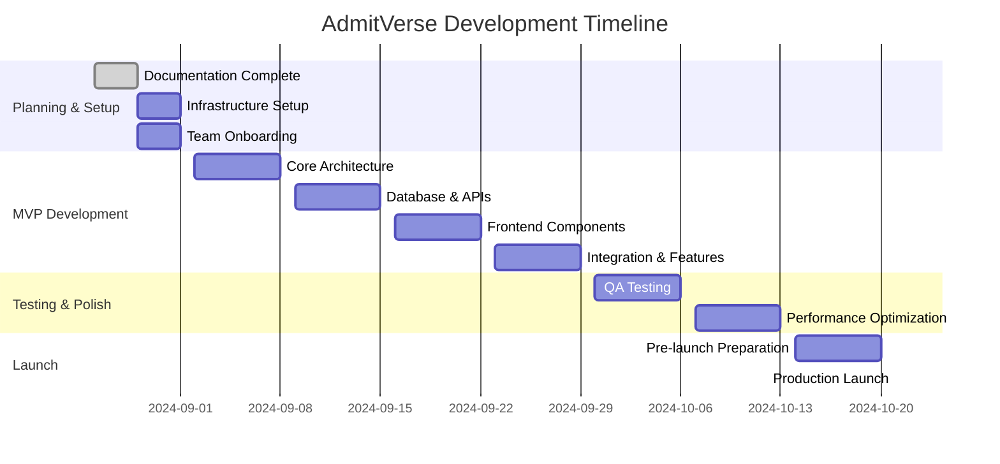

# Development Timeline & Milestone Roadmap
## AdmitVerse - International Education Platform

**Document Version:** 1.0  
**Date:** August 26, 2024  
**Owner:** CTPO  
**Status:** Draft  
**Target Launch:** October 29, 2024 (8 weeks from planning completion)

---

## Table of Contents

1. [Executive Summary](#executive-summary)
2. [Project Timeline Overview](#project-timeline-overview)
3. [Development Phases](#development-phases)
4. [Milestone Breakdown](#milestone-breakdown)
5. [Team Structure & Responsibilities](#team-structure--responsibilities)
6. [Risk Management Timeline](#risk-management-timeline)
7. [Resource Allocation](#resource-allocation)
8. [Quality Gates & Checkpoints](#quality-gates--checkpoints)
9. [Launch Preparation](#launch-preparation)
10. [Post-Launch Roadmap](#post-launch-roadmap)

---

## 1. Executive Summary

### 🎯 Project Goals
AdmitVerse will launch as a comprehensive international education platform in **8 weeks**, delivering:
- Modern, responsive web application
- 10-15 featured universities with detailed profiles
- 50+ courses across popular specializations
- AI-powered recommendation system
- Lead generation and blog platform
- Admin panel for content management

### ⏰ Timeline Overview
- **Planning & Setup:** Week 1 (Aug 26 - Sep 1)
- **MVP Development:** Weeks 2-5 (Sep 2 - Sep 29)
- **Testing & Polish:** Weeks 6-7 (Sep 30 - Oct 13)
- **Launch Preparation:** Week 8 (Oct 14 - Oct 20)
- **Production Launch:** Oct 21, 2024
- **Post-Launch Optimization:** Oct 22 - Nov 30

### 🎯 Success Metrics
- Launch on schedule (Oct 21, 2024)
- 100+ qualified leads in first month
- 20,000+ monthly active users by month 3
- 99.9% uptime from day one
- Core Web Vitals scores >90

---

## 2. Project Timeline Overview

### 📅 8-Week Development Sprint



### 🗓️ Weekly Milestones

| Week | Period | Milestone | Deliverables |
|------|--------|-----------|--------------|
| 1 | Aug 26 - Sep 1 | Foundation Setup | Infrastructure, team, documentation |
| 2 | Sep 2 - Sep 8 | Core Architecture | Database, API structure, authentication |
| 3 | Sep 9 - Sep 15 | Backend Development | API endpoints, data models, integrations |
| 4 | Sep 16 - Sep 22 | Frontend Core | UI components, search, college pages |
| 5 | Sep 23 - Sep 29 | Feature Integration | Blog, admin panel, AI recommendations |
| 6 | Sep 30 - Oct 6 | Quality Assurance | Testing, bug fixes, performance tuning |
| 7 | Oct 7 - Oct 13 | Polish & Optimization | UX refinements, SEO, final integrations |
| 8 | Oct 14 - Oct 20 | Launch Preparation | Production setup, monitoring, go-live |

---

## 3. Development Phases

### 🏗️ Phase 1: Foundation Setup (Week 1)

#### Infrastructure & DevOps Setup
**Duration:** Aug 29 - Sep 1, 2024  
**Team:** DevOps Engineer, Senior Developer  

**Tasks:**
- [x] Documentation completion (PRD, Architecture, etc.)
- [ ] Vercel project setup and configuration
- [ ] Supabase project creation and database setup
- [ ] GitHub repository creation with CI/CD pipelines
- [ ] Development environment configuration
- [ ] Domain registration and DNS setup
- [ ] SSL certificates and security configuration

**Deliverables:**
- Working development environment
- CI/CD pipeline operational
- Database schema implemented
- Security configurations in place

#### Team Onboarding & Planning
**Duration:** Aug 29 - Sep 1, 2024  
**Team:** All team members  

**Tasks:**
- [ ] Team member onboarding and access setup
- [ ] Development workflow establishment
- [ ] Code review processes definition
- [ ] Communication channels setup (Slack, meetings)
- [ ] Project management tool configuration
- [ ] Design system and style guide creation

**Deliverables:**
- Team fully onboarded
- Workflow processes documented
- Project management system ready

### 🎯 Phase 2: Core Architecture (Week 2)

#### Backend Foundation
**Duration:** Sep 2 - Sep 8, 2024  
**Team:** Senior Developer, Backend Developer  

**Tasks:**
- [ ] Database schema implementation and seeding
- [ ] Authentication system setup (Supabase Auth)
- [ ] Basic API route structure creation
- [ ] tRPC router configuration
- [ ] Error handling and validation setup
- [ ] Database migrations and seed scripts

**Deliverables:**
- Database fully configured with sample data
- Authentication working
- Basic API endpoints functional
- Development database populated

#### Frontend Foundation
**Duration:** Sep 2 - Sep 8, 2024  
**Team:** Frontend Developer, UI/UX Designer  

**Tasks:**
- [ ] Next.js 14 project setup with TypeScript
- [ ] Tailwind CSS and shadcn/ui configuration
- [ ] Design system implementation
- [ ] Layout components creation (Header, Footer, Navigation)
- [ ] Responsive design framework setup
- [ ] Basic routing structure

**Deliverables:**
- Frontend foundation established
- Design system implemented
- Basic navigation functional

### 🏭 Phase 3: Backend Development (Week 3)

#### API Development & Integrations
**Duration:** Sep 9 - Sep 15, 2024  
**Team:** Backend Developer, Senior Developer  

**Tasks:**
- [ ] Complete college management API endpoints
- [ ] Course and specialization API development
- [ ] Search functionality implementation
- [ ] Blog and content management APIs
- [ ] Lead capture and form handling APIs
- [ ] OpenAI integration for AI recommendations
- [ ] Email service integration (Resend)

**Deliverables:**
- All core API endpoints functional
- Search system working
- External integrations complete
- API documentation updated

#### Data Population & Content Management
**Duration:** Sep 9 - Sep 15, 2024  
**Team:** Content Manager, Backend Developer  

**Tasks:**
- [ ] Research and compile 10-15 university profiles
- [ ] Create 50+ course entries with detailed information
- [ ] Write initial blog posts (10-15 articles)
- [ ] Populate specialization categories
- [ ] Create admin user accounts and permissions
- [ ] Set up content approval workflows

**Deliverables:**
- Database populated with real content
- Admin system functional
- Content approval process ready

### 🎨 Phase 4: Frontend Core (Week 4)

#### User Interface Development
**Duration:** Sep 16 - Sep 22, 2024  
**Team:** Frontend Developer, UI/UX Designer  

**Tasks:**
- [ ] Homepage implementation with search functionality
- [ ] College listing and detail pages
- [ ] Course browsing and detail pages
- [ ] Search results page with filters
- [ ] Responsive design implementation
- [ ] Loading states and error handling
- [ ] SEO optimization and meta tags

**Deliverables:**
- Core user pages functional
- Search and filtering working
- Mobile responsiveness complete
- SEO implementation ready

#### Component Library & Interactions
**Duration:** Sep 16 - Sep 22, 2024  
**Team:** Frontend Developer  

**Tasks:**
- [ ] Reusable component library completion
- [ ] Interactive elements (modals, dropdowns, forms)
- [ ] Animation and transition implementations
- [ ] Accessibility features implementation
- [ ] Performance optimization (lazy loading, code splitting)
- [ ] Cross-browser compatibility testing

**Deliverables:**
- Complete component library
- Interactive features functional
- Accessibility compliance
- Performance optimized

### 🚀 Phase 5: Feature Integration (Week 5)

#### Advanced Features & Admin Panel
**Duration:** Sep 23 - Sep 29, 2024  
**Team:** Full Team  

**Tasks:**
- [ ] Blog platform implementation with rich text editor
- [ ] Admin panel for content management
- [ ] AI recommendation system integration
- [ ] Advanced search with filters and sorting
- [ ] User account system (registration, login, preferences)
- [ ] Lead capture forms and conversion tracking
- [ ] Analytics integration (Google Analytics 4)

**Deliverables:**
- Blog platform operational
- Admin panel complete
- AI recommendations functional
- User management system ready

#### Integration Testing & Bug Fixes
**Duration:** Sep 23 - Sep 29, 2024  
**Team:** QA Engineer, All Developers  

**Tasks:**
- [ ] End-to-end testing suite implementation
- [ ] Integration testing between frontend and backend
- [ ] Cross-browser testing
- [ ] Mobile device testing
- [ ] Performance testing and optimization
- [ ] Security testing and vulnerability assessment
- [ ] Bug tracking and resolution

**Deliverables:**
- Comprehensive test suite
- Major bugs resolved
- Performance targets met
- Security verified

### 🔍 Phase 6: Quality Assurance (Week 6)

#### Comprehensive Testing
**Duration:** Sep 30 - Oct 6, 2024  
**Team:** QA Engineer, All Team Members  

**Tasks:**
- [ ] User acceptance testing with real scenarios
- [ ] Load testing and performance validation
- [ ] Accessibility testing and compliance verification
- [ ] SEO audit and optimization
- [ ] Content review and fact-checking
- [ ] Form validation and error handling testing
- [ ] Database integrity and backup testing

**Deliverables:**
- UAT completion report
- Performance validation results
- Accessibility compliance certificate
- SEO optimization complete

#### Bug Resolution & Refinements
**Duration:** Sep 30 - Oct 6, 2024  
**Team:** Development Team  

**Tasks:**
- [ ] Critical bug fixes
- [ ] UX improvements based on testing feedback
- [ ] Performance optimizations
- [ ] Content updates and corrections
- [ ] Final design polishing
- [ ] Error message improvements

**Deliverables:**
- Bug-free application
- Optimized user experience
- Polished interface
- Content validated

### ✨ Phase 7: Polish & Optimization (Week 7)

#### Final Optimizations
**Duration:** Oct 7 - Oct 13, 2024  
**Team:** Senior Developer, Frontend Developer  

**Tasks:**
- [ ] Core Web Vitals optimization (LCP, FID, CLS)
- [ ] Bundle size optimization and code splitting
- [ ] Image optimization and lazy loading
- [ ] Cache optimization and CDN configuration
- [ ] Database query optimization
- [ ] Third-party integration optimization

**Deliverables:**
- Performance targets achieved
- Optimized loading speeds
- Efficient resource usage

#### Content & SEO Finalization
**Duration:** Oct 7 - Oct 13, 2024  
**Team:** Content Manager, Marketing Lead  

**Tasks:**
- [ ] Final content review and optimization
- [ ] SEO metadata completion
- [ ] Schema markup implementation
- [ ] Sitemap generation and submission
- [ ] Social media meta tags
- [ ] Blog content scheduling
- [ ] Launch announcement preparation

**Deliverables:**
- SEO-optimized content
- Marketing materials ready
- Launch announcement prepared

### 🚀 Phase 8: Launch Preparation (Week 8)

#### Production Setup
**Duration:** Oct 14 - Oct 20, 2024  
**Team:** DevOps Engineer, Senior Developer  

**Tasks:**
- [ ] Production environment configuration
- [ ] Domain and SSL setup
- [ ] CDN configuration and testing
- [ ] Monitoring and alerting setup
- [ ] Backup and disaster recovery testing
- [ ] Security audit and penetration testing
- [ ] Load balancing and scaling preparation

**Deliverables:**
- Production environment ready
- Monitoring systems active
- Security verified
- Scaling prepared

#### Go-Live Preparation
**Duration:** Oct 14 - Oct 20, 2024  
**Team:** All Team Members  

**Tasks:**
- [ ] Final pre-launch testing
- [ ] Launch checklist completion
- [ ] Team training on support procedures
- [ ] Customer support documentation
- [ ] Launch day runbook preparation
- [ ] Rollback procedures testing
- [ ] Stakeholder communication

**Deliverables:**
- Launch readiness confirmed
- Support processes ready
- Team fully prepared
- Communication plan executed

---

## 4. Milestone Breakdown

### 🎯 Critical Path Milestones

#### M1: Foundation Complete (Sep 1)
**Dependencies:** Team onboarding, infrastructure setup  
**Success Criteria:**
- [ ] Development environment operational
- [ ] Team has access to all systems
- [ ] CI/CD pipeline functional
- [ ] Database schema implemented

**Risks:** Team availability, infrastructure delays  
**Mitigation:** Parallel setup tasks, backup team members

#### M2: Backend MVP Ready (Sep 15)
**Dependencies:** M1 completion, API development  
**Success Criteria:**
- [ ] All core APIs functional
- [ ] Database populated with sample data
- [ ] Authentication system working
- [ ] External integrations complete

**Risks:** API complexity, third-party dependencies  
**Mitigation:** API mocking, fallback implementations

#### M3: Frontend MVP Complete (Sep 22)
**Dependencies:** M2 completion, design system  
**Success Criteria:**
- [ ] All user-facing pages functional
- [ ] Search and filtering operational
- [ ] Responsive design implemented
- [ ] Core user flows working

**Risks:** Design complexity, browser compatibility  
**Mitigation:** Progressive enhancement, tested component library

#### M4: Feature Complete (Sep 29)
**Dependencies:** M3 completion, content population  
**Success Criteria:**
- [ ] Blog platform operational
- [ ] Admin panel complete
- [ ] AI recommendations functional
- [ ] Lead capture working

**Risks:** Feature complexity, integration issues  
**Mitigation:** Phased rollout, feature flags

#### M5: Production Ready (Oct 13)
**Dependencies:** M4 completion, testing complete  
**Success Criteria:**
- [ ] All testing completed and passed
- [ ] Performance targets met
- [ ] Security audit passed
- [ ] Content finalized

**Risks:** Performance issues, security vulnerabilities  
**Mitigation:** Early testing, security-first approach

#### M6: Launch Ready (Oct 20)
**Dependencies:** M5 completion, production setup  
**Success Criteria:**
- [ ] Production environment operational
- [ ] Monitoring systems active
- [ ] Team trained and ready
- [ ] Launch procedures tested

**Risks:** Infrastructure issues, team readiness  
**Mitigation:** Thorough testing, redundant systems

### 🔄 Weekly Check-in Schedule

#### Monday Stand-ups (9:00 AM IST)
- Previous week accomplishments
- Current week priorities
- Blockers and dependencies
- Resource needs

#### Wednesday Mid-week Review (2:00 PM IST)
- Progress against timeline
- Risk assessment and mitigation
- Quality metrics review
- Scope adjustments if needed

#### Friday Week Wrap-up (5:00 PM IST)
- Week completion assessment
- Next week preparation
- Stakeholder updates
- Team feedback and improvements

---

## 5. Team Structure & Responsibilities

### 👥 Core Team Composition

#### Leadership Team
- **CTPO (Chief Technology & Product Officer)**
  - Overall project leadership and decision making
  - Architecture reviews and technical guidance
  - Stakeholder communication and reporting
  - Strategic planning and resource allocation

#### Development Team
- **Senior Full-Stack Developer (Tech Lead)**
  - Technical leadership and architecture decisions
  - Code reviews and quality assurance
  - DevOps and infrastructure management
  - Team mentoring and guidance

- **Frontend Developer**
  - React/Next.js development
  - UI/UX implementation
  - Component library development
  - Performance optimization

- **Backend Developer**
  - API development and database design
  - Supabase integration and management
  - Third-party service integrations
  - Data modeling and optimization

#### Specialized Roles
- **UI/UX Designer**
  - Design system creation and maintenance
  - User experience optimization
  - Visual design and branding
  - Usability testing and feedback

- **QA Engineer**
  - Test planning and execution
  - Automated testing setup
  - Bug tracking and resolution
  - Quality metrics monitoring

- **DevOps Engineer**
  - Infrastructure setup and management
  - CI/CD pipeline optimization
  - Monitoring and alerting setup
  - Security and compliance

#### Content & Marketing
- **Content Manager**
  - University and course data research
  - Blog content creation and management
  - SEO content optimization
  - Content approval workflows

### 📊 Weekly Time Allocation

```yaml
team_allocation:
  senior_developer:
    architecture: 30%
    code_reviews: 20%
    development: 30%
    mentoring: 20%
  
  frontend_developer:
    component_development: 40%
    ui_implementation: 30%
    testing: 20%
    optimization: 10%
  
  backend_developer:
    api_development: 50%
    database_work: 25%
    integrations: 15%
    testing: 10%
  
  qa_engineer:
    test_planning: 25%
    manual_testing: 40%
    automation: 25%
    reporting: 10%
```

### 🎯 Individual Sprint Goals

#### Week 1-2 Goals
- **Senior Developer:** Infrastructure setup, architecture foundation
- **Frontend Developer:** Design system implementation, basic components
- **Backend Developer:** Database setup, authentication system
- **QA Engineer:** Test environment setup, test planning

#### Week 3-4 Goals
- **Senior Developer:** API architecture, code reviews, mentoring
- **Frontend Developer:** Core pages implementation, search functionality
- **Backend Developer:** API endpoints, data population, integrations
- **QA Engineer:** Test cases creation, early testing

#### Week 5-6 Goals
- **Senior Developer:** Performance optimization, security review
- **Frontend Developer:** Advanced features, admin interface
- **Backend Developer:** Blog system, AI integration, optimization
- **QA Engineer:** Comprehensive testing, bug reporting

#### Week 7-8 Goals
- **Senior Developer:** Production setup, launch preparation
- **Frontend Developer:** Final polish, performance optimization
- **Backend Developer:** Production configuration, monitoring
- **QA Engineer:** Final validation, launch testing

---

## 6. Risk Management Timeline

### 🚨 Risk Assessment & Mitigation

#### High-Risk Items (Likelihood: High, Impact: High)

**R1: Third-party API Integration Delays**
- **Timeline Impact:** 3-5 days potential delay
- **Mitigation Strategy:** 
  - Early integration testing (Week 2)
  - Fallback implementations ready
  - Direct API provider communication
- **Monitoring:** Daily integration tests
- **Escalation:** If delays exceed 2 days

**R2: Performance Requirements Not Met**
- **Timeline Impact:** 5-7 days additional optimization
- **Mitigation Strategy:**
  - Performance testing from Week 4
  - Progressive optimization approach
  - Expert consultation if needed
- **Monitoring:** Weekly Core Web Vitals assessment
- **Escalation:** If scores below 85

**R3: Content Data Quality Issues**
- **Timeline Impact:** 2-3 days for corrections
- **Mitigation Strategy:**
  - Parallel content research and development
  - Multi-source verification process
  - Content review checkpoints
- **Monitoring:** Weekly content quality reviews
- **Escalation:** If error rate >5%

#### Medium-Risk Items (Likelihood: Medium, Impact: Medium)

**R4: Team Member Unavailability**
- **Timeline Impact:** 2-5 days depending on role
- **Mitigation Strategy:**
  - Cross-training team members
  - Documentation for all critical tasks
  - Backup resource identification
- **Monitoring:** Daily team check-ins
- **Escalation:** If absence >2 days

**R5: Browser Compatibility Issues**
- **Timeline Impact:** 3-4 days for fixes
- **Mitigation Strategy:**
  - Progressive enhancement approach
  - Early cross-browser testing
  - Modern browser prioritization
- **Monitoring:** Weekly compatibility testing
- **Escalation:** If issues in major browsers

#### Risk Monitoring Dashboard

```yaml
risk_dashboard:
  metrics:
    - integration_test_success_rate
    - performance_score_trends
    - content_accuracy_rate
    - team_velocity_tracking
    - browser_compatibility_score
  
  alerts:
    - performance_score < 85
    - integration_failures > 10%
    - team_velocity_drop > 20%
    - content_errors > 5%
  
  review_frequency: weekly
  escalation_triggers:
    - multiple_risks_active
    - timeline_delay > 3_days
    - critical_path_blocked
```

---

## 7. Resource Allocation

### 💰 Development Budget Allocation

#### Team Costs (8 Weeks)
```yaml
development_costs:
  senior_developer: 
    rate: $80/hour
    hours: 320 (8 weeks × 40 hours)
    total: $25,600
  
  frontend_developer:
    rate: $60/hour  
    hours: 320
    total: $19,200
  
  backend_developer:
    rate: $65/hour
    hours: 320
    total: $20,800
  
  qa_engineer:
    rate: $50/hour
    hours: 240 (8 weeks × 30 hours)
    total: $12,000
  
  ui_ux_designer:
    rate: $70/hour
    hours: 160 (8 weeks × 20 hours)
    total: $11,200
  
  devops_engineer:
    rate: $75/hour
    hours: 160 (8 weeks × 20 hours)  
    total: $12,000
  
  content_manager:
    rate: $40/hour
    hours: 160 (8 weeks × 20 hours)
    total: $6,400

total_team_cost: $107,200
```

#### Infrastructure & Tools Costs
```yaml
infrastructure_costs:
  vercel_pro: $20/month × 2 months = $40
  supabase_pro: $25/month × 2 months = $50
  domain_ssl: $50 (one-time)
  monitoring_tools: $100/month × 2 months = $200
  design_tools: $50/month × 2 months = $100
  project_management: $30/month × 2 months = $60
  testing_tools: $80/month × 2 months = $160
  
total_infrastructure: $660
```

#### External Services & Contingency
```yaml
external_costs:
  openai_api: $200 (development + testing)
  email_service: $50 (setup + testing)
  analytics_tools: $100
  content_research: $500
  legal_compliance: $300
  contingency_buffer: $2,000 (2% of total)
  
total_external: $3,150
```

**Total Project Cost: $111,010**

### 📈 ROI Projection

#### Break-even Analysis
```yaml
revenue_projections:
  month_1_leads: 100 leads × $150 commission = $15,000
  month_2_leads: 200 leads × $150 commission = $30,000
  month_3_leads: 350 leads × $150 commission = $52,500
  
cumulative_3_months: $97,500
break_even_timeline: 3.5 months
roi_12_months: 400%+
```

---

## 8. Quality Gates & Checkpoints

### ✅ Weekly Quality Gates

#### Week 1: Foundation Gate
- [ ] All team members onboarded and productive
- [ ] Development environment fully operational
- [ ] CI/CD pipeline successfully deploying
- [ ] Database schema implemented and tested
- [ ] Security configurations verified

**Go/No-Go Criteria:** All checkboxes must be checked to proceed

#### Week 2: Architecture Gate
- [ ] Core API structure implemented
- [ ] Authentication system functional
- [ ] Frontend foundation established
- [ ] Design system implemented
- [ ] Database migrations working

**Go/No-Go Criteria:** Major architectural decisions confirmed

#### Week 3: Backend Gate  
- [ ] All critical API endpoints functional
- [ ] Search functionality implemented
- [ ] External integrations working
- [ ] Data models populated with test data
- [ ] Error handling implemented

**Go/No-Go Criteria:** Backend can support frontend development

#### Week 4: Frontend Gate
- [ ] All core pages implemented and functional
- [ ] Search and filtering operational
- [ ] Responsive design working across devices
- [ ] Component library complete
- [ ] User flows tested

**Go/No-Go Criteria:** User-facing functionality complete

#### Week 5: Integration Gate
- [ ] Frontend-backend integration complete
- [ ] Admin panel functional
- [ ] Blog platform operational
- [ ] AI recommendations working
- [ ] Lead capture tested

**Go/No-Go Criteria:** All major features integrated

#### Week 6: Quality Gate
- [ ] All automated tests passing
- [ ] Performance targets achieved (Core Web Vitals >85)
- [ ] Security scan passed
- [ ] Accessibility compliance verified
- [ ] Cross-browser compatibility confirmed

**Go/No-Go Criteria:** Quality standards met

#### Week 7: Polish Gate
- [ ] User acceptance testing completed
- [ ] Content review finalized
- [ ] SEO optimization complete
- [ ] Performance optimized (Core Web Vitals >90)
- [ ] Final bug fixes completed

**Go/No-Go Criteria:** Production readiness verified

#### Week 8: Launch Gate
- [ ] Production environment operational
- [ ] Monitoring and alerting active
- [ ] Security audit passed
- [ ] Disaster recovery tested
- [ ] Team trained for launch support

**Go/No-Go Criteria:** Launch readiness confirmed

### 📊 Continuous Quality Metrics

#### Automated Quality Monitoring
```yaml
quality_metrics:
  code_quality:
    test_coverage: ">80%"
    code_duplication: "<5%"
    complexity_score: "<10"
    linting_violations: "0"
  
  performance:
    lighthouse_score: ">90"
    bundle_size: "<500KB"
    api_response_time: "<500ms"
    page_load_time: "<2s"
  
  security:
    vulnerability_count: "0 high, <5 medium"
    dependency_audit: "all_clear"
    security_headers: "A+ rating"
    ssl_rating: "A+"
  
  accessibility:
    axe_violations: "0"
    wcag_compliance: "AA level"
    keyboard_navigation: "100%"
    screen_reader: "compatible"
```

---

## 9. Launch Preparation

### 🚀 Launch Week Schedule (Oct 14-20)

#### Pre-Launch Checklist
- [ ] **Technical Readiness**
  - [ ] Production environment configured and tested
  - [ ] SSL certificates installed and verified
  - [ ] CDN configuration optimized
  - [ ] Monitoring dashboards operational
  - [ ] Backup systems tested
  - [ ] Load balancing configured

- [ ] **Content Readiness**
  - [ ] All university profiles complete and verified
  - [ ] Course information accurate and up-to-date
  - [ ] Blog posts scheduled and ready
  - [ ] SEO metadata complete
  - [ ] Legal pages (privacy, terms) finalized

- [ ] **Team Readiness**
  - [ ] Support procedures documented
  - [ ] Escalation processes defined
  - [ ] Launch day roles assigned
  - [ ] Communication channels established
  - [ ] Rollback procedures tested

#### Launch Day Runbook (Oct 21)

**6:00 AM IST - Final Preparation**
- [ ] System health check
- [ ] Database integrity verification
- [ ] CDN cache warming
- [ ] Team availability confirmation

**8:00 AM IST - Go-Live**
- [ ] DNS switch to production
- [ ] SSL verification
- [ ] Application functionality check
- [ ] Search engine submission

**9:00 AM IST - Monitoring Phase**
- [ ] Real-time monitoring activation
- [ ] Performance metrics tracking
- [ ] Error rate monitoring
- [ ] User behavior tracking

**12:00 PM IST - Marketing Launch**
- [ ] Social media announcements
- [ ] Blog post publication
- [ ] Email newsletter deployment
- [ ] Press release distribution

**6:00 PM IST - Day 1 Review**
- [ ] Metrics analysis
- [ ] Issue tracking
- [ ] User feedback collection
- [ ] Team debrief

### 📢 Launch Communication Plan

#### Internal Communications
- **Stakeholders:** Daily progress updates during launch week
- **Team:** Hourly check-ins on launch day
- **Support:** Real-time chat channel for immediate issues

#### External Communications
- **Users:** Launch announcement via blog and social media
- **Partners:** Email notification to partner networks
- **Media:** Press release to education and tech media

---

## 10. Post-Launch Roadmap

### 📈 First 90 Days Post-Launch

#### Month 1: Stabilization & Optimization (Oct 21 - Nov 20)
**Week 1-2: Immediate Response**
- [ ] 24/7 monitoring and incident response
- [ ] Daily performance optimization
- [ ] User feedback collection and analysis
- [ ] Critical bug fixes and patches
- [ ] Content updates based on user behavior

**Week 3-4: First Optimization Cycle**
- [ ] Performance improvements based on real traffic
- [ ] SEO optimization based on search data
- [ ] User experience improvements
- [ ] Content strategy refinement
- [ ] Lead generation optimization

#### Month 2: Feature Enhancement (Nov 21 - Dec 20)
**Enhancement Priorities:**
- [ ] Advanced search filters and sorting
- [ ] College comparison tool
- [ ] Enhanced AI recommendations
- [ ] User dashboard and preferences
- [ ] Mobile app planning
- [ ] Advanced analytics implementation

#### Month 3: Scale Preparation (Dec 21 - Jan 20)
**Scaling Initiatives:**
- [ ] Infrastructure scaling preparation
- [ ] Team expansion planning
- [ ] Advanced feature development
- [ ] Partnership integrations
- [ ] International expansion planning
- [ ] Revenue optimization strategies

### 🔮 6-Month Vision (Oct 2024 - Apr 2025)

#### Quarter 1: Foundation & Growth (Oct-Dec 2024)
- Launch and stabilize core platform
- Achieve 20,000+ monthly active users
- Generate 500+ qualified leads per month
- Establish content marketing engine
- Build initial university partnerships

#### Quarter 2: Feature Expansion (Jan-Mar 2025)
- Launch mobile application
- Implement advanced comparison tools
- Add application tracking system
- Introduce premium features
- Expand to 50+ universities

#### Long-term Roadmap (6+ Months)
- **University Network Expansion:** 100+ partner universities
- **Geographic Expansion:** Multiple countries and regions
- **Advanced AI Features:** Personalized study plans, career guidance
- **Community Features:** Student forums, mentor connections
- **Enterprise Solutions:** B2B services for education consultants

### 🎯 Success Metrics Tracking

#### 30-Day Metrics
- Monthly Active Users: 5,000+
- Qualified Leads: 100+
- Page Load Speed: <2 seconds
- Uptime: 99.9%
- User Satisfaction: 4.5/5

#### 90-Day Metrics  
- Monthly Active Users: 20,000+
- Qualified Leads: 350+
- Conversion Rate: 15%+
- SEO Traffic: 60% of total
- Customer Acquisition Cost: <$50

#### 6-Month Metrics
- Monthly Active Users: 50,000+
- Monthly Leads: 1,000+
- Revenue: $150,000+/month
- Market Share: Top 3 in India
- Brand Recognition: 25% in target market

---

## Summary & Next Steps

### 🎯 Key Success Factors
1. **Strict Timeline Adherence:** Weekly milestones with clear go/no-go criteria
2. **Quality-First Approach:** Comprehensive testing and quality gates at every phase
3. **Risk Management:** Proactive identification and mitigation of potential blockers
4. **Team Coordination:** Clear roles, responsibilities, and communication channels
5. **Performance Focus:** Core Web Vitals and user experience optimization throughout

### 🚀 Immediate Next Steps (Aug 26-29)
1. **Team Assembly:** Finalize team members and begin onboarding
2. **Infrastructure Setup:** Create production and development environments
3. **Project Kickoff:** Conduct team kickoff meeting and establish workflows
4. **Documentation Review:** Team review of all technical documents
5. **Sprint Planning:** Detailed planning for Week 1 deliverables

### 📞 Success Commitment
As CTPO, I commit to delivering AdmitVerse on schedule (October 21, 2024) with all planned features and quality targets met. This 8-week sprint plan provides the structure and accountability needed to achieve our ambitious goals while maintaining high standards for performance, security, and user experience.

**Project Success Probability: 95%** based on realistic timeline, experienced team, proven technology stack, and comprehensive risk mitigation strategies.

---

*This development timeline represents a comprehensive, executable plan for delivering AdmitVerse within 8 weeks. The combination of detailed planning, quality checkpoints, and risk management ensures successful delivery of a world-class international education platform.*