# AdmitVerse - Technical Architecture Document

**Version**: 1.0  
**Date**: August 26, 2024  
**Document Owner**: CTPO  
**Status**: Draft  

---

## 📋 Table of Contents

1. [Executive Summary](#executive-summary)
2. [System Overview](#system-overview)
3. [Technology Stack](#technology-stack)
4. [Architecture Design](#architecture-design)
5. [Database Design](#database-design)
6. [API Architecture](#api-architecture)
7. [Frontend Architecture](#frontend-architecture)
8. [Security Architecture](#security-architecture)
9. [Performance & Scalability](#performance--scalability)
10. [Deployment Strategy](#deployment-strategy)
11. [Monitoring & Observability](#monitoring--observability)
12. [Development Workflow](#development-workflow)

---

## 1. Executive Summary

### 🎯 Architecture Vision
AdmitVerse technical architecture is designed as a modern, cloud-native, serverless-first platform that prioritizes performance, scalability, and developer experience. The architecture follows microservices principles with a monorepo structure for optimal code sharing and deployment coordination.

### 🏗️ Key Architectural Principles
- **API-First Design**: All functionality exposed through well-defined APIs
- **Mobile-First Responsive**: Optimized for mobile devices with progressive enhancement
- **Performance-Centric**: Sub-2-second page loads with intelligent caching
- **Scalable by Design**: Horizontal scaling capabilities from day one
- **Security-First**: Zero-trust security model with end-to-end encryption
- **Developer Experience**: Modern tooling with type safety and automated testing

### 📊 Technical Highlights
- **Frontend**: Next.js 14 with React Server Components
- **Backend**: Supabase (PostgreSQL + Edge Functions)
- **Database**: PostgreSQL with real-time subscriptions
- **Search**: Full-text search with future Algolia integration
- **AI**: OpenAI API integration for personalized recommendations
- **Deployment**: Vercel + Supabase Cloud with global CDN

---

## 2. System Overview

### 🌐 High-Level Architecture

```mermaid
graph TB
    User[👨‍🎓 User] --> CDN[🌐 Vercel Edge Network]
    CDN --> Frontend[⚛️ Next.js Frontend]
    Frontend --> API[🔌 API Layer]
    API --> Auth[🔐 Supabase Auth]
    API --> DB[🗄️ PostgreSQL Database]
    API --> Storage[📁 Supabase Storage]
    API --> Search[🔍 Search Engine]
    API --> AI[🤖 OpenAI API]
    API --> Analytics[📊 Analytics]
    
    Admin[👨‍💻 Admin] --> AdminPanel[⚙️ Admin Panel]
    AdminPanel --> API
    
    subgraph "Supabase Cloud"
        Auth
        DB
        Storage
        RealTime[📡 Real-time Subscriptions]
    end
    
    subgraph "External Services"
        AI
        Analytics
        Search
    end
```



### 🏛️ System Components

#### **Frontend Layer**
- **Public Website**: Next.js application with SSR/SSG for optimal SEO
- **Admin Panel**: React-based administrative interface
- **Shared Components**: Reusable UI library with Tailwind CSS

#### **API Layer**
- **tRPC**: End-to-end type-safe API with automatic TypeScript generation
- **REST Endpoints**: RESTful APIs for external integrations
- **GraphQL**: Real-time data subscriptions via Supabase

#### **Data Layer**
- **PostgreSQL**: Primary database with ACID compliance
- **Redis Cache**: Session storage and frequent query caching
- **File Storage**: Images, documents, and media assets

#### **External Integrations**
- **OpenAI API**: AI-powered recommendations and content generation
- **Google Analytics**: User behavior tracking and insights
- **Email Service**: Transactional emails and newsletters

---

## 3. Technology Stack

### 🛠️ Frontend Technologies

#### **Core Framework**
```json
{
  "framework": "Next.js 14",
  "version": "14.x",
  "features": [
    "App Router",
    "React Server Components", 
    "Server Actions",
    "TypeScript",
    "Turbopack"
  ]
}
```

#### **UI & Styling**
```json
{
  "styling": "Tailwind CSS",
  "components": "shadcn/ui",
  "icons": "Lucide React",
  "animations": "Framer Motion",
  "forms": "React Hook Form + Zod"
}
```

#### **State Management**
```json
{
  "client_state": "Zustand",
  "server_state": "TanStack Query",
  "form_state": "React Hook Form",
  "url_state": "Next.js Router"
}
```

### 🔧 Backend Technologies

#### **Database & Backend**
```json
{
  "database": "PostgreSQL 15+",
  "backend_service": "Supabase",
  "orm": "Prisma",
  "api_layer": "tRPC",
  "edge_functions": "Supabase Edge Functions"
}
```

#### **Authentication & Security**
```json
{
  "auth_provider": "Supabase Auth",
  "auth_methods": ["Email/Password", "OAuth"],
  "authorization": "Row Level Security (RLS)",
  "encryption": "AES-256"
}
```

### 🔍 Search & AI Technologies

#### **Search Engine**
```json
{
  "primary": "PostgreSQL Full-Text Search",
  "future": "Algolia",
  "features": [
    "Autocomplete",
    "Faceted Search",
    "Typo Tolerance",
    "Geo Search"
  ]
}
```

#### **AI Integration**
```json
{
  "provider": "OpenAI",
  "models": ["GPT-4", "text-embedding-ada-002"],
  "use_cases": [
    "Content Recommendations",
    "Search Query Understanding",
    "Content Generation",
    "Semantic Search"
  ]
}
```

### 📱 Development Tools

#### **Development Environment**
```json
{
  "package_manager": "pnpm",
  "monorepo": "Turborepo",
  "linting": "ESLint + Prettier",
  "testing": "Vitest + Playwright",
  "ci_cd": "GitHub Actions"
}
```

---

## 4. Architecture Design

### 🏗️ Monorepo Structure

```
admitverse/
├── apps/
│   ├── web/                 # Public website (Next.js)
│   │   ├── app/            # App Router pages
│   │   ├── components/     # Page-specific components
│   │   ├── lib/           # Utilities and configurations
│   │   └── public/        # Static assets
│   │
│   └── admin/              # Admin panel (Next.js)
│       ├── app/           # Admin interface pages
│       ├── components/    # Admin-specific components
│       └── lib/          # Admin utilities
│
├── packages/
│   ├── ui/                # Shared UI components
│   │   ├── components/    # Reusable components
│   │   ├── styles/       # Global styles
│   │   └── icons/        # Icon library
│   │
│   ├── database/          # Database schemas and migrations
│   │   ├── schema/       # Prisma schemas
│   │   ├── migrations/   # Database migrations
│   │   └── seed/         # Seed data
│   │
│   ├── api/              # Shared API logic
│   │   ├── routers/      # tRPC routers
│   │   ├── middleware/   # API middleware
│   │   └── utils/        # API utilities
│   │
│   ├── types/            # Shared TypeScript types
│   │   ├── database.ts   # Database types
│   │   ├── api.ts        # API types
│   │   └── common.ts     # Common types
│   │
│   └── config/           # Shared configurations
│       ├── tailwind/     # Tailwind config
│       ├── eslint/       # ESLint config
│       └── typescript/   # TypeScript config
│
├── docs/                 # Documentation
├── scripts/              # Build and deployment scripts
└── tools/               # Development tools
```

### 🔄 Data Flow Architecture


### 🎯 Component Architecture

#### **Frontend Components Hierarchy**
```
App
├── Layout
│   ├── Header
│   │   ├── Navigation
│   │   ├── SearchBar
│   │   └── UserMenu
│   ├── Main
│   │   ├── PageContent
│   │   └── Sidebar
│   └── Footer
│
├── Pages
│   ├── HomePage
│   │   ├── HeroSection
│   │   ├── FeaturedColleges
│   │   ├── PopularCourses
│   │   └── BlogSection
│   │
│   ├── SearchResults
│   │   ├── SearchFilters
│   │   ├── ResultsList
│   │   └── Pagination
│   │
│   ├── CollegePage
│   │   ├── CollegeHeader
│   │   ├── CourseList
│   │   ├── AdmissionInfo
│   │   └── ContactForm
│   │
│   └── AdminPanel
│       ├── Dashboard
│       ├── CollegeManager
│       ├── CourseManager
│       └── BlogEditor
│
└── Shared Components
    ├── UI Components (shadcn/ui)
    ├── Form Components
    ├── Data Display Components
    └── Navigation Components
```

---

## 5. Database Design

### 🗄️ Database Schema Overview

#### **Core Entities Relationship**


#### **Database Tables Specification**

##### **Colleges Table**
```sql
CREATE TABLE colleges (
    id UUID PRIMARY KEY DEFAULT gen_random_uuid(),
    name VARCHAR(255) NOT NULL,
    short_name VARCHAR(100),
    location VARCHAR(255) NOT NULL,
    country VARCHAR(100) NOT NULL,
    city VARCHAR(100) NOT NULL,
    founded_year INTEGER,
    college_type VARCHAR(50) NOT NULL, -- 'Public', 'Private', 'Deemed'
    accreditation JSONB,
    website VARCHAR(255),
    description TEXT,
    contact_info JSONB,
    campus_facilities JSONB,
    total_students INTEGER,
    total_faculty INTEGER,
    student_faculty_ratio DECIMAL(5,2),
    campus_size VARCHAR(100),
    ranking_national INTEGER,
    ranking_international INTEGER,
    rating DECIMAL(3,2) DEFAULT 0,
    total_reviews INTEGER DEFAULT 0,
    placement_percentage DECIMAL(5,2),
    average_package DECIMAL(12,2),
    highest_package DECIMAL(12,2),
    top_recruiters JSONB,
    hostel_facilities BOOLEAN DEFAULT false,
    library_books INTEGER,
    research_facilities JSONB,
    sports_facilities JSONB,
    featured_image VARCHAR(500),
    gallery_images JSONB,
    virtual_tour_link VARCHAR(500),
    is_featured BOOLEAN DEFAULT false,
    is_active BOOLEAN DEFAULT true,
    seo_title VARCHAR(255),
    seo_description TEXT,
    seo_keywords JSONB,
    created_at TIMESTAMP WITH TIME ZONE DEFAULT NOW(),
    updated_at TIMESTAMP WITH TIME ZONE DEFAULT NOW()
);

-- Indexes for performance
CREATE INDEX idx_colleges_country_city ON colleges(country, city);
CREATE INDEX idx_colleges_featured ON colleges(is_featured, is_active);
CREATE INDEX idx_colleges_rating ON colleges(rating DESC);
CREATE INDEX idx_colleges_search ON colleges USING gin(to_tsvector('english', name || ' ' || COALESCE(description, '')));
```

##### **Courses Table**
```sql
CREATE TABLE courses (
    id UUID PRIMARY KEY DEFAULT gen_random_uuid(),
    name VARCHAR(255) NOT NULL,
    short_name VARCHAR(100),
    level VARCHAR(50) NOT NULL, -- 'Undergraduate', 'Postgraduate', 'Doctorate'
    category VARCHAR(100) NOT NULL, -- 'Engineering', 'Business', 'Medicine', etc.
    duration VARCHAR(50),
    duration_months INTEGER,
    description TEXT,
    curriculum JSONB,
    prerequisites TEXT,
    learning_outcomes JSONB,
    career_prospects TEXT,
    average_salary_range JSONB,
    job_roles JSONB,
    skills_developed JSONB,
    certification_body VARCHAR(255),
    accreditation JSONB,
    exam_pattern JSONB,
    eligibility_criteria TEXT,
    application_process TEXT,
    important_dates JSONB,
    icon_name VARCHAR(100),
    featured_image VARCHAR(500),
    is_popular BOOLEAN DEFAULT false,
    is_active BOOLEAN DEFAULT true,
    seo_title VARCHAR(255),
    seo_description TEXT,
    seo_keywords JSONB,
    created_at TIMESTAMP WITH TIME ZONE DEFAULT NOW(),
    updated_at TIMESTAMP WITH TIME ZONE DEFAULT NOW()
);

-- Indexes
CREATE INDEX idx_courses_category ON courses(category, is_active);
CREATE INDEX idx_courses_level ON courses(level, is_active);
CREATE INDEX idx_courses_popular ON courses(is_popular, is_active);
CREATE INDEX idx_courses_search ON courses USING gin(to_tsvector('english', name || ' ' || COALESCE(description, '')));
```

### 🔍 Search Optimization

#### **Full-Text Search Configuration**
```sql
-- Create search vectors for better performance
ALTER TABLE colleges ADD COLUMN search_vector tsvector;
ALTER TABLE courses ADD COLUMN search_vector tsvector;
ALTER TABLE specializations ADD COLUMN search_vector tsvector;

-- Update search vectors
UPDATE colleges SET search_vector = 
    to_tsvector('english', name || ' ' || COALESCE(description, '') || ' ' || location);

-- Create GIN indexes for full-text search
CREATE INDEX idx_colleges_fts ON colleges USING gin(search_vector);
CREATE INDEX idx_courses_fts ON courses USING gin(search_vector);

-- Create triggers to auto-update search vectors
CREATE OR REPLACE FUNCTION update_search_vector()
RETURNS trigger AS $$
BEGIN
    NEW.search_vector := to_tsvector('english', 
        NEW.name || ' ' || COALESCE(NEW.description, '') || ' ' || NEW.location);
    RETURN NEW;
END;
$$ LANGUAGE plpgsql;

CREATE TRIGGER colleges_search_vector_update 
    BEFORE INSERT OR UPDATE ON colleges
    FOR EACH ROW EXECUTE FUNCTION update_search_vector();
```

---

## 6. API Architecture

### 🔌 API Design Principles

#### **tRPC Configuration**
```typescript
// packages/api/src/router.ts
import { z } from 'zod';
import { createTRPCRouter, publicProcedure, protectedProcedure } from './trpc';

export const appRouter = createTRPCRouter({
  // Public routes
  colleges: createTRPCRouter({
    search: publicProcedure
      .input(z.object({
        query: z.string().optional(),
        country: z.string().optional(),
        category: z.string().optional(),
        limit: z.number().min(1).max(100).default(20),
        offset: z.number().min(0).default(0)
      }))
      .query(async ({ input, ctx }) => {
        // Search implementation
      }),
    
    getById: publicProcedure
      .input(z.object({ id: z.string().uuid() }))
      .query(async ({ input, ctx }) => {
        // Get college by ID
      }),
    
    getFeatured: publicProcedure
      .input(z.object({ limit: z.number().default(6) }))
      .query(async ({ input, ctx }) => {
        // Get featured colleges
      })
  }),
  
  // Protected admin routes
  admin: createTRPCRouter({
    colleges: createTRPCRouter({
      create: protectedProcedure
        .input(collegeCreateSchema)
        .mutation(async ({ input, ctx }) => {
          // Create college
        }),
      
      update: protectedProcedure
        .input(collegeUpdateSchema)
        .mutation(async ({ input, ctx }) => {
          // Update college
        }),
      
      delete: protectedProcedure
        .input(z.object({ id: z.string().uuid() }))
        .mutation(async ({ input, ctx }) => {
          // Delete college
        })
    })
  })
});

export type AppRouter = typeof appRouter;
```

#### **API Endpoints Structure**
```
/api/trpc/
├── colleges
│   ├── search              # GET - Search colleges
│   ├── getById            # GET - Get college details
│   ├── getFeatured        # GET - Get featured colleges
│   └── getByCategory      # GET - Get colleges by category
│
├── courses
│   ├── search              # GET - Search courses
│   ├── getById            # GET - Get course details
│   ├── getPopular         # GET - Get popular courses
│   └── getByCollege       # GET - Get courses by college
│
├── specializations
│   ├── search              # GET - Search specializations
│   ├── getById            # GET - Get specialization details
│   ├── getTrending        # GET - Get trending specializations
│   └── getByCourse        # GET - Get specializations by course
│
├── search
│   ├── global              # GET - Global search across all entities
│   ├── suggestions        # GET - Search suggestions/autocomplete
│   └── filters            # GET - Get available filters
│
├── ai
│   ├── recommendations    # POST - Get AI recommendations
│   ├── similarColleges   # GET - Get similar colleges
│   └── careerPath        # POST - Get career path suggestions
│
├── leads
│   ├── create             # POST - Create new lead
│   └── subscribe         # POST - Newsletter subscription
│
├── blog
│   ├── getAll             # GET - Get all blog posts
│   ├── getById           # GET - Get blog post by ID
│   ├── getFeatured       # GET - Get featured blog posts
│   └── getByCategory     # GET - Get blog posts by category
│
└── admin
    ├── colleges           # CRUD operations for colleges
    ├── courses           # CRUD operations for courses
    ├── specializations   # CRUD operations for specializations
    ├── blogs             # CRUD operations for blogs
    ├── leads             # Lead management
    └── analytics         # Admin analytics
```

### 🔐 Authentication & Authorization

#### **Supabase Auth Integration**
```typescript
// lib/auth.ts
import { createClient } from '@supabase/supabase-js';
import type { Database } from '@/types/database';

export const supabase = createClient<Database>(
  process.env.NEXT_PUBLIC_SUPABASE_URL!,
  process.env.NEXT_PUBLIC_SUPABASE_ANON_KEY!
);

// Row Level Security Policies
export const RLS_POLICIES = {
  // Public read access for active colleges
  colleges: `
    CREATE POLICY "Public colleges are viewable by everyone"
    ON colleges FOR SELECT
    USING (is_active = true);
  `,
  
  // Admin-only write access
  colleges_admin: `
    CREATE POLICY "Admins can manage colleges"
    ON colleges FOR ALL
    USING (auth.jwt() ->> 'role' = 'admin');
  `,
  
  // Public read for published blogs
  blogs: `
    CREATE POLICY "Published blogs are viewable by everyone"
    ON blogs FOR SELECT
    USING (is_published = true);
  `
};
```

---

## 7. Frontend Architecture

### ⚛️ Next.js App Router Structure

#### **App Directory Structure**
```
apps/web/app/
├── globals.css             # Global styles
├── layout.tsx             # Root layout
├── page.tsx              # Homepage
├── loading.tsx           # Global loading UI
├── error.tsx            # Global error UI
├── not-found.tsx        # 404 page
│
├── search/
│   ├── page.tsx          # Search results page
│   ├── loading.tsx       # Search loading UI
│   └── components/       # Search-specific components
│
├── colleges/
│   ├── page.tsx          # Colleges listing
│   ├── [id]/
│   │   ├── page.tsx      # College detail page
│   │   ├── loading.tsx   # College loading UI
│   │   └── components/   # College-specific components
│   └── components/       # Colleges-specific components
│
├── courses/
│   ├── page.tsx          # Courses listing
│   ├── [id]/
│   │   └── page.tsx      # Course detail page
│   └── components/
│
├── blog/
│   ├── page.tsx          # Blog listing
│   ├── [slug]/
│   │   └── page.tsx      # Blog post page
│   └── components/
│
├── api/
│   ├── trpc/[trpc]/      # tRPC API routes
│   ├── auth/             # Auth API routes
│   └── webhooks/         # Webhook handlers
│
└── (admin)/              # Route group for admin
    ├── layout.tsx        # Admin layout
    ├── dashboard/
    ├── colleges/
    ├── courses/
    └── blog/
```

#### **Component Architecture**
```typescript
// Shared component structure
export interface ComponentProps {
  className?: string;
  children?: React.ReactNode;
}

// Example: College Card Component
interface CollegeCardProps extends ComponentProps {
  college: College;
  variant?: 'default' | 'compact' | 'detailed';
  onAction?: (action: string, college: College) => void;
}

export function CollegeCard({ 
  college, 
  variant = 'default', 
  className,
  onAction 
}: CollegeCardProps) {
  return (
    <Card className={cn('hover:shadow-lg transition-shadow', className)}>
      <CardHeader>
        <div className="flex justify-between items-start">
          <div>
            <CardTitle>{college.name}</CardTitle>
            <CardDescription>{college.location}</CardDescription>
          </div>
          <Badge variant={college.is_featured ? 'default' : 'secondary'}>
            {college.is_featured ? 'Featured' : college.college_type}
          </Badge>
        </div>
      </CardHeader>
      
      <CardContent>
        <div className="space-y-2">
          <div className="flex items-center justify-between">
            <span className="text-sm text-muted-foreground">Rating</span>
            <div className="flex items-center">
              <Star className="h-4 w-4 fill-yellow-400 text-yellow-400" />
              <span className="ml-1 text-sm font-medium">{college.rating}</span>
            </div>
          </div>
          
          {variant === 'detailed' && (
            <>
              <div className="flex items-center justify-between">
                <span className="text-sm text-muted-foreground">Students</span>
                <span className="text-sm font-medium">
                  {college.total_students?.toLocaleString()}
                </span>
              </div>
              
              <div className="flex items-center justify-between">
                <span className="text-sm text-muted-foreground">Placement</span>
                <span className="text-sm font-medium">
                  {college.placement_percentage}%
                </span>
              </div>
            </>
          )}
        </div>
      </CardContent>
      
      <CardFooter>
        <Button 
          className="w-full" 
          onClick={() => onAction?.('view', college)}
        >
          View Details
        </Button>
      </CardFooter>
    </Card>
  );
}
```

### 🎨 Design System

#### **Tailwind Configuration**
```javascript
// packages/config/tailwind/tailwind.config.js
module.exports = {
  content: [
    './app/**/*.{js,ts,jsx,tsx}',
    './pages/**/*.{js,ts,jsx,tsx}',
    './components/**/*.{js,ts,jsx,tsx}',
    '../../packages/ui/src/**/*.{js,ts,jsx,tsx}'
  ],
  theme: {
    extend: {
      colors: {
        brand: {
          50: '#eff6ff',
          100: '#dbeafe',
          500: '#3b82f6',
          600: '#2563eb',
          700: '#1d4ed8',
          900: '#1e3a8a',
        }
      },
      fontFamily: {
        sans: ['Inter', 'system-ui', 'sans-serif'],
      },
      container: {
        center: true,
        padding: '2rem',
        screens: {
          '2xl': '1400px',
        },
      },
    },
  },
  plugins: [
    require('tailwindcss-animate'),
    require('@tailwindcss/typography'),
    require('@tailwindcss/forms'),
  ],
};
```

---

## 8. Security Architecture

### 🔐 Security Framework

#### **Authentication Strategy**
```typescript
// Security configuration
export const SECURITY_CONFIG = {
  auth: {
    provider: 'supabase',
    session_timeout: 24 * 60 * 60, // 24 hours
    refresh_threshold: 60 * 60, // 1 hour
    mfa_enabled: false, // Future implementation
  },
  
  authorization: {
    method: 'role_based',
    roles: ['admin', 'editor', 'user'],
    permissions: {
      admin: ['*'],
      editor: ['colleges:read', 'colleges:write', 'blogs:*'],
      user: ['colleges:read', 'courses:read', 'blogs:read']
    }
  },
  
  data_protection: {
    encryption: 'AES-256',
    hashing: 'bcrypt',
    salt_rounds: 12,
    pii_encryption: true
  },
  
  api_security: {
    rate_limiting: {
      window: 900000, // 15 minutes
      max_requests: 100,
      skip_successful_requests: false
    },
    cors: {
      origin: process.env.NODE_ENV === 'production' 
        ? ['https://admitverse.com', 'https://admin.admitverse.com']
        : ['http://localhost:3000', 'http://localhost:3001'],
      credentials: true
    }
  }
};
```

#### **Row Level Security (RLS) Policies**
```sql
-- Enable RLS on all tables
ALTER TABLE colleges ENABLE ROW LEVEL SECURITY;
ALTER TABLE courses ENABLE ROW LEVEL SECURITY;
ALTER TABLE specializations ENABLE ROW LEVEL SECURITY;
ALTER TABLE blogs ENABLE ROW LEVEL SECURITY;
ALTER TABLE leads ENABLE ROW LEVEL SECURITY;

-- Public read access for active content
CREATE POLICY "Public read access for active colleges" ON colleges
  FOR SELECT USING (is_active = true);

CREATE POLICY "Public read access for active courses" ON courses
  FOR SELECT USING (is_active = true);

CREATE POLICY "Public read access for published blogs" ON blogs
  FOR SELECT USING (is_published = true);

-- Admin full access
CREATE POLICY "Admin full access to colleges" ON colleges
  FOR ALL USING (
    auth.jwt() ->> 'role' = 'admin' OR
    auth.jwt() ->> 'user_role' = 'admin'
  );

-- Lead access restrictions
CREATE POLICY "Leads are insertable by anyone" ON leads
  FOR INSERT WITH CHECK (true);

CREATE POLICY "Leads are viewable by admins only" ON leads
  FOR SELECT USING (
    auth.jwt() ->> 'role' = 'admin'
  );
```

### 🛡️ Data Protection

#### **Input Validation & Sanitization**
```typescript
// Zod schemas for validation
export const collegeCreateSchema = z.object({
  name: z.string().min(1).max(255).trim(),
  short_name: z.string().max(100).optional(),
  location: z.string().min(1).max(255),
  country: z.string().min(1).max(100),
  city: z.string().min(1).max(100),
  founded_year: z.number().int().min(1800).max(new Date().getFullYear()).optional(),
  college_type: z.enum(['Public', 'Private', 'Deemed']),
  website: z.string().url().optional(),
  description: z.string().max(5000).optional(),
  rating: z.number().min(0).max(5).optional(),
  total_students: z.number().int().min(0).optional(),
  placement_percentage: z.number().min(0).max(100).optional(),
  is_featured: z.boolean().default(false),
});

// Sanitization middleware
export const sanitizeInput = (input: unknown): unknown => {
  if (typeof input === 'string') {
    return DOMPurify.sanitize(input.trim());
  }
  if (Array.isArray(input)) {
    return input.map(sanitizeInput);
  }
  if (typeof input === 'object' && input !== null) {
    const sanitized: Record<string, unknown> = {};
    for (const [key, value] of Object.entries(input)) {
      sanitized[key] = sanitizeInput(value);
    }
    return sanitized;
  }
  return input;
};
```

---

## 9. Performance & Scalability

### ⚡ Performance Optimization

#### **Caching Strategy**
```typescript
// Multi-layer caching implementation
export const CACHE_CONFIG = {
  // Browser cache
  browser: {
    static_assets: '1y',
    dynamic_content: '5m',
    api_responses: '1m'
  },
  
  // CDN cache (Vercel Edge)
  cdn: {
    static_pages: '1h',
    dynamic_pages: '5m',
    api_responses: '1m',
    images: '1d'
  },
  
  // Application cache (React Query)
  application: {
    colleges: 300000, // 5 minutes
    courses: 600000, // 10 minutes
    search_results: 120000, // 2 minutes
    blog_posts: 900000 // 15 minutes
  },
  
  // Database cache
  database: {
    connection_pool: 20,
    query_cache: true,
    prepared_statements: true
  }
};

// React Query configuration
export const queryClient = new QueryClient({
  defaultOptions: {
    queries: {
      staleTime: 5 * 60 * 1000, // 5 minutes
      cacheTime: 10 * 60 * 1000, // 10 minutes
      refetchOnWindowFocus: false,
      retry: (failureCount, error) => {
        if (failureCount < 3 && error.status !== 404) {
          return true;
        }
        return false;
      }
    }
  }
});
```

#### **Image Optimization**
```typescript
// Next.js Image optimization configuration
export const IMAGE_CONFIG = {
  domains: ['supabase.co', 'images.unsplash.com', 'cdn.admitverse.com'],
  formats: ['image/webp', 'image/avif'],
  sizes: {
    thumbnail: 150,
    small: 300,
    medium: 600,
    large: 1200,
    xlarge: 1920
  },
  quality: 85,
  placeholder: 'blur',
  loading: 'lazy'
};

// Component usage
<Image
  src={college.featured_image}
  alt={college.name}
  width={600}
  height={400}
  className="rounded-lg object-cover"
  placeholder="blur"
  blurDataURL="data:image/jpeg;base64,/9j/4AAQSkZJRgABAQAAAQABAAD..."
  sizes="(max-width: 768px) 100vw, (max-width: 1200px) 50vw, 33vw"
/>
```

### 📈 Scalability Design

#### **Database Scaling Strategy**
```sql
-- Partitioning for large tables
CREATE TABLE leads_y2024 PARTITION OF leads
  FOR VALUES FROM ('2024-01-01') TO ('2025-01-01');

-- Indexes for performance
CREATE INDEX CONCURRENTLY idx_colleges_search_gin 
  ON colleges USING gin(search_vector);

CREATE INDEX CONCURRENTLY idx_leads_created_at 
  ON leads (created_at DESC);

-- Connection pooling configuration
-- max_connections = 100
-- shared_buffers = 256MB
-- effective_cache_size = 1GB
-- work_mem = 4MB
```

#### **Horizontal Scaling Architecture**
```yaml
# Future scaling considerations
scaling_strategy:
  database:
    read_replicas: 2
    connection_pooling: pgbouncer
    query_optimization: automatic
  
  application:
    auto_scaling: true
    min_instances: 2
    max_instances: 10
    scaling_metrics:
      - cpu_utilization: 70%
      - memory_utilization: 80%
      - response_time: 2000ms
  
  caching:
    redis_cluster: true
    cdn_optimization: vercel_edge
    static_asset_optimization: true
  
  monitoring:
    performance_budgets: true
    real_user_monitoring: true
    synthetic_monitoring: true
```

---

## 10. Deployment Strategy

### 🚀 Deployment Architecture

#### **Infrastructure Overview**
```yaml
# Production deployment configuration
production:
  frontend:
    platform: vercel
    build_command: "turbo build --filter=web"
    output_directory: "apps/web/.next"
    node_version: "18.x"
    regions: ["cle1", "bom1", "sin1"] # Global edge deployment
    
  database:
    provider: supabase_cloud
    region: "ap-south-1" # Mumbai
    backup_policy: "daily"
    point_in_time_recovery: true
    
  storage:
    provider: supabase_storage
    cdn: supabase_cdn
    image_optimization: true
    
  monitoring:
    uptime: uptime_robot
    performance: vercel_analytics
    errors: sentry
    logs: vercel_logs

staging:
  frontend:
    platform: vercel_preview
    auto_deploy: true
    branch_deployments: true
    
  database:
    provider: supabase_staging
    data_sync: weekly_production_snapshot
```

#### **CI/CD Pipeline**
```yaml
# .github/workflows/deploy.yml
name: Deploy to Production

on:
  push:
    branches: [main]
  pull_request:
    branches: [main]

jobs:
  test:
    runs-on: ubuntu-latest
    steps:
      - uses: actions/checkout@v4
      - uses: pnpm/action-setup@v2
        with:
          version: 8
      - uses: actions/setup-node@v4
        with:
          node-version: '18'
          cache: 'pnpm'
      
      - run: pnpm install --frozen-lockfile
      - run: pnpm run lint
      - run: pnpm run type-check
      - run: pnpm run test
      - run: pnpm run build

  deploy-staging:
    needs: test
    runs-on: ubuntu-latest
    if: github.event_name == 'pull_request'
    steps:
      - uses: actions/checkout@v4
      - name: Deploy to Vercel Preview
        uses: amondnet/vercel-action@v25
        with:
          vercel-token: ${{ secrets.VERCEL_TOKEN }}
          vercel-org-id: ${{ secrets.VERCEL_ORG_ID }}
          vercel-project-id: ${{ secrets.VERCEL_PROJECT_ID }}

  deploy-production:
    needs: test
    runs-on: ubuntu-latest
    if: github.ref == 'refs/heads/main'
    steps:
      - uses: actions/checkout@v4
      - name: Deploy to Vercel Production
        uses: amondnet/vercel-action@v25
        with:
          vercel-token: ${{ secrets.VERCEL_TOKEN }}
          vercel-org-id: ${{ secrets.VERCEL_ORG_ID }}
          vercel-project-id: ${{ secrets.VERCEL_PROJECT_ID }}
          vercel-args: '--prod'
```

### 🌐 Environment Configuration

#### **Environment Variables**
```bash
# .env.production
# Database
NEXT_PUBLIC_SUPABASE_URL=https://your-project.supabase.co
NEXT_PUBLIC_SUPABASE_ANON_KEY=your-anon-key
SUPABASE_SERVICE_ROLE_KEY=your-service-role-key

# OpenAI
OPENAI_API_KEY=your-openai-key
OPENAI_ORGANIZATION=your-org-id

# Analytics
NEXT_PUBLIC_GA_ID=G-XXXXXXXXXX

# Admin
ADMIN_EMAIL=admin@admitverse.com
JWT_SECRET=your-jwt-secret

# External Services
SMTP_HOST=smtp.sendgrid.net
SMTP_PORT=587
SMTP_USER=apikey
SMTP_PASS=your-sendgrid-key

# Security
ALLOWED_ORIGINS=https://admitverse.com,https://admin.admitverse.com
RATE_LIMIT_WINDOW=900000
RATE_LIMIT_MAX=100
```

---

## 11. Monitoring & Observability

### 📊 Monitoring Stack

#### **Performance Monitoring**
```typescript
// Performance monitoring configuration
export const MONITORING_CONFIG = {
  // Core Web Vitals
  performance: {
    lcp_threshold: 2500, // Largest Contentful Paint
    fid_threshold: 100,  // First Input Delay
    cls_threshold: 0.1,  // Cumulative Layout Shift
    fcp_threshold: 1800, // First Contentful Paint
    ttfb_threshold: 600, // Time to First Byte
  },
  
  // Business metrics
  business: {
    conversion_rate: 'leads_created / unique_visitors',
    search_success_rate: 'searches_with_results / total_searches',
    user_engagement: 'avg_session_duration',
    content_performance: 'blog_reads / blog_views'
  },
  
  // Technical metrics
  technical: {
    api_response_time: '95th_percentile',
    error_rate: 'errors / total_requests',
    uptime: '99.9%',
    database_performance: 'query_execution_time'
  }
};

// Custom analytics tracking
export const trackEvent = (event: string, properties?: Record<string, any>) => {
  if (typeof window !== 'undefined' && window.gtag) {
    window.gtag('event', event, {
      custom_parameter_1: properties?.value,
      custom_parameter_2: properties?.category,
      ...properties
    });
  }
};

// Usage examples
trackEvent('college_search', { 
  query: searchQuery, 
  filters: activeFilters,
  results_count: resultsCount 
});

trackEvent('lead_generated', { 
  source: 'college_page',
  college_id: collegeId,
  course_interest: courseInterest 
});
```

#### **Error Tracking & Alerting**
```typescript
// Error boundary with Sentry integration
export class ErrorBoundary extends React.Component {
  constructor(props: Props) {
    super(props);
    this.state = { hasError: false };
  }

  static getDerivedStateFromError(error: Error): State {
    return { hasError: true };
  }

  componentDidCatch(error: Error, errorInfo: ErrorInfo) {
    console.error('Error caught by boundary:', error, errorInfo);
    
    // Send to error tracking service
    if (typeof window !== 'undefined' && window.Sentry) {
      window.Sentry.captureException(error, {
        contexts: {
          react: {
            componentStack: errorInfo.componentStack,
          },
        },
      });
    }
  }

  render() {
    if (this.state.hasError) {
      return (
        <div className="error-fallback">
          <h2>Something went wrong.</h2>
          <button onClick={() => this.setState({ hasError: false })}>
            Try again
          </button>
        </div>
      );
    }

    return this.props.children;
  }
}
```

### 🔍 Logging Strategy

#### **Structured Logging**
```typescript
// Centralized logging utility
export enum LogLevel {
  DEBUG = 0,
  INFO = 1,
  WARN = 2,
  ERROR = 3,
}

interface LogEntry {
  timestamp: string;
  level: LogLevel;
  message: string;
  context?: Record<string, any>;
  userId?: string;
  sessionId?: string;
  requestId?: string;
}

export class Logger {
  private static instance: Logger;
  private logLevel: LogLevel;

  constructor(logLevel: LogLevel = LogLevel.INFO) {
    this.logLevel = logLevel;
  }

  static getInstance(): Logger {
    if (!Logger.instance) {
      Logger.instance = new Logger(
        process.env.NODE_ENV === 'production' ? LogLevel.WARN : LogLevel.DEBUG
      );
    }
    return Logger.instance;
  }

  private log(level: LogLevel, message: string, context?: Record<string, any>) {
    if (level < this.logLevel) return;

    const entry: LogEntry = {
      timestamp: new Date().toISOString(),
      level,
      message,
      context,
      requestId: this.getRequestId(),
      sessionId: this.getSessionId(),
    };

    // Console output for development
    if (process.env.NODE_ENV === 'development') {
      console.log(JSON.stringify(entry, null, 2));
    }

    // Send to external logging service in production
    if (process.env.NODE_ENV === 'production') {
      this.sendToLoggingService(entry);
    }
  }

  info(message: string, context?: Record<string, any>) {
    this.log(LogLevel.INFO, message, context);
  }

  warn(message: string, context?: Record<string, any>) {
    this.log(LogLevel.WARN, message, context);
  }

  error(message: string, error?: Error, context?: Record<string, any>) {
    this.log(LogLevel.ERROR, message, {
      ...context,
      error: error?.message,
      stack: error?.stack,
    });
  }

  private sendToLoggingService(entry: LogEntry) {
    // Integration with logging service (e.g., DataDog, LogRocket)
    fetch('/api/logs', {
      method: 'POST',
      headers: { 'Content-Type': 'application/json' },
      body: JSON.stringify(entry),
    }).catch(() => {
      // Fail silently to avoid infinite loops
    });
  }
}

// Usage throughout the application
const logger = Logger.getInstance();

logger.info('User searched for colleges', {
  query: searchQuery,
  userId: user?.id,
  resultsCount: results.length
});

logger.error('Failed to load college data', error, {
  collegeId,
  userId: user?.id
});
```

---

## 12. Development Workflow

### 👨‍💻 Development Process

#### **Development Environment Setup**
```bash
# Clone repository
git clone https://github.com/admitverse/platform.git
cd platform

# Install dependencies
pnpm install

# Setup environment variables
cp .env.example .env.local
# Edit .env.local with your configuration

# Setup database
pnpm db:setup

# Start development servers
pnpm dev

# Available at:
# - Main app: http://localhost:3000
# - Admin panel: http://localhost:3001
# - Storybook: http://localhost:6006
```

#### **Code Quality Standards**
```json
{
  "scripts": {
    "dev": "turbo dev",
    "build": "turbo build",
    "lint": "turbo lint",
    "lint:fix": "turbo lint:fix",
    "type-check": "turbo type-check",
    "test": "turbo test",
    "test:e2e": "turbo test:e2e",
    "format": "prettier --write \"**/*.{ts,tsx,md,json}\"",
    "clean": "turbo clean"
  },
  
  "husky": {
    "hooks": {
      "pre-commit": "lint-staged",
      "commit-msg": "commitlint -E HUSKY_GIT_PARAMS",
      "pre-push": "pnpm run type-check && pnpm run test"
    }
  },
  
  "lint-staged": {
    "*.{ts,tsx}": [
      "eslint --fix",
      "prettier --write"
    ],
    "*.{md,json}": [
      "prettier --write"
    ]
  }
}
```

#### **Testing Strategy**
```typescript
// Unit testing with Vitest
// packages/api/src/routers/colleges.test.ts
import { describe, it, expect, beforeEach } from 'vitest';
import { createTRPCMsw } from 'msw-trpc';
import { appRouter } from './router';

describe('Colleges Router', () => {
  beforeEach(() => {
    // Setup test data
  });

  it('should search colleges by query', async () => {
    const caller = appRouter.createCaller({
      db: mockDatabase,
      user: null
    });

    const result = await caller.colleges.search({
      query: 'IIT',
      limit: 10
    });

    expect(result.data).toHaveLength(3);
    expect(result.data[0].name).toContain('IIT');
  });

  it('should return featured colleges', async () => {
    const caller = appRouter.createCaller({
      db: mockDatabase,
      user: null
    });

    const result = await caller.colleges.getFeatured({
      limit: 6
    });

    expect(result.data).toHaveLength(6);
    expect(result.data.every(college => college.is_featured)).toBe(true);
  });
});

// E2E testing with Playwright
// apps/web/tests/search.spec.ts
import { test, expect } from '@playwright/test';

test.describe('College Search', () => {
  test('should search and display results', async ({ page }) => {
    await page.goto('/');
    
    // Search for colleges
    await page.fill('[data-testid="search-input"]', 'IIT Delhi');
    await page.click('[data-testid="search-button"]');
    
    // Verify results
    await expect(page).toHaveURL(/\/search/);
    await expect(page.locator('[data-testid="college-card"]')).toHaveCount(1);
    await expect(page.locator('text=Indian Institute of Technology')).toBeVisible();
  });
  
  test('should filter search results', async ({ page }) => {
    await page.goto('/search?query=engineering');
    
    // Apply filters
    await page.click('[data-testid="filter-country"]');
    await page.click('text=India');
    
    // Verify filtered results
    await expect(page.locator('[data-testid="college-card"]')).toHaveCount(5);
  });
});
```

### 🔄 Git Workflow

#### **Branch Strategy**
```
main
├── develop
│   ├── feature/search-enhancement
│   ├── feature/ai-recommendations
│   └── hotfix/search-bug-fix
│
├── release/v1.0.0
└── hotfix/critical-security-fix
```

#### **Commit Standards**
```bash
# Conventional Commits format
feat(colleges): add advanced search filters
fix(api): resolve college data fetching issue
docs(readme): update setup instructions
style(ui): improve mobile responsive design
refactor(database): optimize search queries
test(search): add unit tests for search functionality
chore(deps): update dependencies

# Examples
git commit -m "feat(search): implement autocomplete suggestions"
git commit -m "fix(admin): resolve college form validation"
git commit -m "docs(api): add endpoint documentation"
```

---

## 📞 Contact Information

**Document Owner**: CTPO  
**Last Updated**: August 26, 2024  
**Next Review**: September 26, 2024  
**Distribution**: Engineering Team, Product Team, DevOps Team

---

*This document contains proprietary and confidential information. Distribution is restricted to authorized personnel only.*