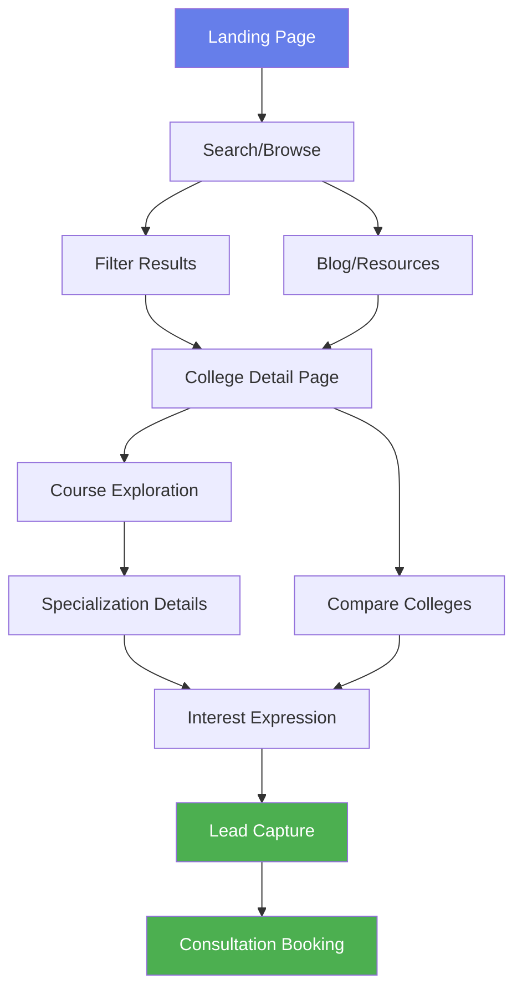

# UI/UX Wireframes & Component Architecture
## AdmitVerse - International Education Platform

**Document Version:** 1.0  
**Date:** August 26, 2024  
**Owner:** CTPO  
**Status:** Draft

---

## Table of Contents

1. [Executive Summary](#executive-summary)
2. [Design System & Guidelines](#design-system--guidelines)
3. [Information Architecture](#information-architecture)
4. [User Journey & Flow](#user-journey--flow)
5. [Wireframes](#wireframes)
6. [Component Architecture](#component-architecture)
7. [Responsive Design Strategy](#responsive-design-strategy)
8. [Accessibility Standards](#accessibility-standards)
9. [Performance Considerations](#performance-considerations)
10. [Implementation Guidelines](#implementation-guidelines)

---

## 1. Executive Summary

### 🎯 Design Philosophy
AdmitVerse will follow a modern, clean, and user-centric design approach that prioritizes:
- **Clarity**: Clear information hierarchy and intuitive navigation
- **Speed**: Fast loading and efficient user interactions
- **Trust**: Professional aesthetics that build confidence
- **Accessibility**: Inclusive design for all users

### 🎨 Visual Identity
- **Primary Color:** #667eea (Modern Blue)
- **Secondary Color:** #764ba2 (Purple Gradient)
- **Accent Colors:** Success (#4caf50), Warning (#ff9800), Error (#f44336)
- **Typography:** Inter/System fonts for clarity and performance
- **Design Language:** Modern, minimalist with card-based layouts

---

## 2. Design System & Guidelines

### 🎨 Color Palette

```css
/* Primary Colors */
--color-primary: #667eea;
--color-primary-dark: #5a6fd8;
--color-primary-light: #8da4f1;

/* Secondary Colors */
--color-secondary: #764ba2;
--color-secondary-dark: #6a4190;
--color-secondary-light: #8a65b4;

/* Semantic Colors */
--color-success: #4caf50;
--color-warning: #ff9800;
--color-error: #f44336;
--color-info: #2196f3;

/* Neutral Colors */
--color-white: #ffffff;
--color-gray-50: #f8f9fa;
--color-gray-100: #e9ecef;
--color-gray-200: #dee2e6;
--color-gray-300: #ced4da;
--color-gray-400: #adb5bd;
--color-gray-500: #6c757d;
--color-gray-600: #495057;
--color-gray-700: #343a40;
--color-gray-800: #212529;
--color-gray-900: #0d1117;
```

### 🔤 Typography Scale

```css
/* Font Families */
--font-family-primary: 'Inter', -apple-system, BlinkMacSystemFont, 'Segoe UI', sans-serif;
--font-family-mono: 'JetBrains Mono', 'Fira Code', monospace;

/* Font Sizes */
--text-xs: 0.75rem;     /* 12px */
--text-sm: 0.875rem;    /* 14px */
--text-base: 1rem;      /* 16px */
--text-lg: 1.125rem;    /* 18px */
--text-xl: 1.25rem;     /* 20px */
--text-2xl: 1.5rem;     /* 24px */
--text-3xl: 1.875rem;   /* 30px */
--text-4xl: 2.25rem;    /* 36px */
--text-5xl: 3rem;       /* 48px */
--text-6xl: 3.75rem;    /* 60px */
```

### 📏 Spacing System

```css
/* Spacing Scale (Based on 8px grid) */
--space-1: 0.25rem;     /* 4px */
--space-2: 0.5rem;      /* 8px */
--space-3: 0.75rem;     /* 12px */
--space-4: 1rem;        /* 16px */
--space-5: 1.25rem;     /* 20px */
--space-6: 1.5rem;      /* 24px */
--space-8: 2rem;        /* 32px */
--space-10: 2.5rem;     /* 40px */
--space-12: 3rem;       /* 48px */
--space-16: 4rem;       /* 64px */
--space-20: 5rem;       /* 80px */
--space-24: 6rem;       /* 96px */
```

### 🔲 Component Specifications

#### Buttons
```css
/* Primary Button */
.btn-primary {
  background: linear-gradient(135deg, var(--color-primary) 0%, var(--color-secondary) 100%);
  color: white;
  padding: var(--space-3) var(--space-6);
  border-radius: 8px;
  font-weight: 600;
  transition: all 0.2s ease;
}

/* Secondary Button */
.btn-secondary {
  background: transparent;
  color: var(--color-primary);
  border: 2px solid var(--color-primary);
  padding: var(--space-3) var(--space-6);
  border-radius: 8px;
}

/* CTA Button */
.btn-cta {
  background: var(--color-success);
  color: white;
  padding: var(--space-4) var(--space-8);
  border-radius: 12px;
  font-size: var(--text-lg);
  font-weight: 700;
}
```

#### Cards
```css
.card {
  background: white;
  border: 1px solid var(--color-gray-200);
  border-radius: 12px;
  padding: var(--space-6);
  box-shadow: 0 2px 8px rgba(0,0,0,0.1);
  transition: all 0.2s ease;
}

.card:hover {
  box-shadow: 0 4px 16px rgba(0,0,0,0.15);
  transform: translateY(-2px);
}
```

---

## 3. Information Architecture

### 🗂️ Site Structure

```
AdmitVerse Platform
├── Home Page
├── Search & Discovery
│   ├── Global Search
│   ├── Advanced Filters
│   └── Search Results
├── College Pages
│   ├── College Detail
│   ├── Courses List
│   └── Specializations
├── Course Pages
│   ├── Course Detail
│   └── Related Courses
├── City/Location Pages
├── Blog & Resources
│   ├── Blog Home
│   ├── Article Detail
│   └── Resource Categories
├── User Features
│   ├── User Dashboard
│   ├── Saved Items
│   └── Recommendations
└── Lead Generation
    ├── Contact Forms
    ├── Consultation Request
    └── Newsletter Signup
```

### 🧭 Navigation Hierarchy

#### Primary Navigation
1. **Colleges** - Browse colleges by location, ranking, specialization
2. **Courses** - Explore courses and programs
3. **Cities** - Discover study destinations
4. **Resources** - Blog, guides, and educational content
5. **Get Help** - Contact, consultation, support

#### Secondary Navigation
- Search Bar (Global)
- User Account/Profile
- Saved Items
- Language Selector
- Mobile Menu

---

## 4. User Journey & Flow

### 🚶‍♂️ Primary User Journey: College Discovery



### 📱 Key User Flows

#### 1. First-Time Visitor Flow
1. **Landing Page** → Hero section with search
2. **Search Query** → "Computer Science USA"
3. **Results Page** → Filtered colleges with key info
4. **College Page** → Detailed information
5. **CTA Action** → "Get Free Consultation"

#### 2. Returning User Flow
1. **Homepage** → Personalized recommendations
2. **Saved Items** → Previous research
3. **New Discovery** → Based on preferences
4. **Comparison** → Side-by-side analysis
5. **Decision** → Contact form submission

#### 3. Mobile User Flow
1. **Mobile Search** → Voice/text input
2. **Quick Filters** → Location, budget, subject
3. **Card Swipe** → Browse results
4. **College Overview** → Key facts
5. **Call/WhatsApp** → Direct contact

---

## 5. Wireframes

### 🏠 Homepage Wireframe

```
┌─────────────────────────────────────────┐
│ [Logo] AdmitVerse     [Search] [Menu]   │
├─────────────────────────────────────────┤
│                                         │
│         🚀 HERO SECTION                │
│    Find Your Dream International         │
│         University                      │
│                                         │
│   [Global Search Bar with Suggestions]  │
│   "Search colleges, courses, cities"    │
│                                         │
│  [Popular: Computer Science] [MBA]      │
│  [Medicine] [Engineering] [View All]    │
└─────────────────────────────────────────┘
┌─────────────────────────────────────────┐
│           FEATURED COLLEGES             │
│                                         │
│  ┌─────┐ ┌─────┐ ┌─────┐ ┌─────┐      │
│  │ MIT │ │ IIT │ │ Cambridge │ │ Stanford│
│  │ USA │ │ UK  │ │ UK    │ │ USA    │    │
│  └─────┘ └─────┘ └─────┘ └─────┘      │
└─────────────────────────────────────────┘
┌─────────────────────────────────────────┐
│         POPULAR DESTINATIONS            │
│                                         │
│   🇺🇸 USA     🇬🇧 UK      🇨🇦 Canada   │
│   🇦🇺 Australia 🇩🇪 Germany 🇸🇬 Singapore │
│                                         │
│         [Explore All Countries]         │
└─────────────────────────────────────────┘
┌─────────────────────────────────────────┐
│           RECENT BLOG POSTS             │
│                                         │
│  ┌──────────────────────────────────┐   │
│  │ "Top 10 Universities for CS"    │   │
│  │ Published: Aug 20, 2024         │   │
│  └──────────────────────────────────┘   │
│                                         │
│           [View All Posts]              │
└─────────────────────────────────────────┘
```

### 🔍 Search Results Wireframe

```
┌─────────────────────────────────────────┐
│ [Logo]     [Search: "Computer Science"] │
├─────────────────────────────────────────┤
│                                         │
│ FILTERS          │     RESULTS          │
│                  │                      │
│ 📍 Location      │  ┌─────────────────┐ │
│ □ USA            │  │ MIT              │ │
│ □ UK             │  │ Cambridge, MA    │ │
│ □ Canada         │  │ ⭐ Rank: #1      │ │
│                  │  │ 💰 $55,000/year │ │
│ 💰 Fees          │  │ [View Details]   │ │
│ □ <$30k          │  └─────────────────┘ │
│ □ $30k-60k       │                      │
│ □ >$60k          │  ┌─────────────────┐ │
│                  │  │ Stanford         │ │
│ 🎓 Degree        │  │ Palo Alto, CA   │ │
│ □ Bachelor's     │  │ ⭐ Rank: #2      │ │
│ □ Master's       │  │ 💰 $58,000/year │ │
│ □ PhD            │  │ [View Details]   │ │
│                  │  └─────────────────┘ │
│ [Apply Filters]  │                      │
│                  │     [Load More]      │
└─────────────────────────────────────────┘
```

### 🏫 College Detail Page Wireframe

```
┌─────────────────────────────────────────┐
│ [Breadcrumb: Home > USA > MIT]          │
├─────────────────────────────────────────┤
│                                         │
│  ┌─────────────────────────────────────┐ │
│  │     MIT HERO SECTION                │ │
│  │   [College Image Gallery]           │ │
│  │                                     │ │
│  │  Massachusetts Institute of         │ │
│  │  Technology                         │ │
│  │  📍 Cambridge, MA, USA              │ │
│  │  ⭐ Rank: #1 | 👥 11,000 students   │ │
│  │                                     │ │
│  │  [Get Free Consultation] [Save]     │ │
│  └─────────────────────────────────────┘ │
│                                         │
│  ┌─────────────┬─────────────┬────────┐ │
│  │ OVERVIEW    │ COURSES     │ ADMISSIONS │
│  │             │             │            │
│  │ • Founded   │ ┌─────────┐ │ Requirements│
│  │   1861      │ │ Computer│ │ • GPA: 3.8+ │
│  │ • Type:     │ │ Science │ │ • SAT: 1500+│
│  │   Private   │ │ 🎓 MS/PhD│ │ • TOEFL: 100│
│  │ • Students: │ └─────────┘ │            │
│  │   11,324    │             │ Deadlines   │
│  │ • Faculty:  │ ┌─────────┐ │ • Fall: Jan15│
│  │   1,000+    │ │Business │ │ • Spring:    │
│  │            │ │ Admin   │ │   Sep 15     │
│  │ Tuition:    │ │ 🎓 MBA  │ │            │
│  │ $55,878     │ └─────────┘ │ [Apply Now] │
│  └─────────────┴─────────────┴────────────┘
└─────────────────────────────────────────┘
```

### 📱 Mobile Wireframes

#### Mobile Homepage
```
┌─────────────────┐
│ ☰  AdmitVerse 🔍│
├─────────────────┤
│                 │
│   🚀 Find Your  │
│  Dream University│
│                 │
│ ┌─────────────┐ │
│ │🔍 Search...  │ │
│ └─────────────┘ │
│                 │
│ Popular Searches│
│ [CS] [MBA] [Med]│
│                 │
│ Featured        │
│ ┌─────────────┐ │
│ │    MIT      │ │
│ │ Cambridge   │ │
│ │ ⭐ #1 • 💰$55k│ │
│ └─────────────┘ │
│                 │
│ ┌─────────────┐ │
│ │  Stanford   │ │
│ │ Palo Alto   │ │
│ │ ⭐ #2 • 💰$58k│ │
│ └─────────────┘ │
└─────────────────┘
```

#### Mobile Search Results
```
┌─────────────────┐
│ ← Computer Science│
├─────────────────┤
│ 🔧 Filters  📊 Sort│
├─────────────────┤
│ ┌─────────────┐ │
│ │ ▓▓▓ MIT ▓▓▓ │ │
│ │ Cambridge, MA│ │
│ │ ⭐ Rank #1    │ │
│ │ 💰 $55k/year │ │
│ │ ❤️ 👁️ 📋      │ │
│ └─────────────┘ │
│                 │
│ ┌─────────────┐ │
│ │ ▓▓ Stanford ▓│ │
│ │ Palo Alto, CA│ │
│ │ ⭐ Rank #2    │ │
│ │ 💰 $58k/year │ │
│ │ ❤️ 👁️ 📋      │ │
│ └─────────────┘ │
│                 │
│   [Load More]   │
└─────────────────┘
```

---

## 6. Component Architecture

### 🧩 Component Hierarchy

```typescript
// Component Structure
src/
├── components/
│   ├── ui/                    // Base UI components
│   │   ├── Button/
│   │   ├── Card/
│   │   ├── Input/
│   │   ├── Modal/
│   │   └── Spinner/
│   ├── layout/               // Layout components
│   │   ├── Header/
│   │   ├── Footer/
│   │   ├── Sidebar/
│   │   └── Container/
│   ├── features/             // Feature-specific components
│   │   ├── search/
│   │   │   ├── SearchBar/
│   │   │   ├── SearchFilters/
│   │   │   └── SearchResults/
│   │   ├── colleges/
│   │   │   ├── CollegeCard/
│   │   │   ├── CollegeGrid/
│   │   │   └── CollegeDetail/
│   │   ├── courses/
│   │   └── blog/
│   └── widgets/              // Reusable widgets
│       ├── HeroSection/
│       ├── FeaturedContent/
│       └── LeadCapture/
```

### 🔧 Core Components Specification

#### SearchBar Component
```typescript
interface SearchBarProps {
  placeholder?: string;
  suggestions?: string[];
  onSearch: (query: string) => void;
  onSuggestionSelect: (suggestion: string) => void;
  loading?: boolean;
  size?: 'sm' | 'md' | 'lg';
}

// Usage Examples:
// <SearchBar 
//   placeholder="Search colleges, courses, cities..."
//   suggestions={searchSuggestions}
//   onSearch={handleSearch}
//   size="lg"
// />
```

#### CollegeCard Component
```typescript
interface CollegeCardProps {
  college: {
    id: string;
    name: string;
    location: string;
    ranking?: number;
    fees: {
      min: number;
      max: number;
      currency: string;
    };
    image: string;
    featured?: boolean;
  };
  onSave: (collegeId: string) => void;
  onView: (collegeId: string) => void;
  variant?: 'default' | 'compact' | 'featured';
}
```

#### SearchFilters Component
```typescript
interface SearchFiltersProps {
  filters: {
    location: string[];
    fees: { min: number; max: number };
    degree: string[];
    ranking: { min: number; max: number };
  };
  onFilterChange: (filters: FilterState) => void;
  onReset: () => void;
  isLoading?: boolean;
}
```

#### LeadCaptureForm Component
```typescript
interface LeadCaptureFormProps {
  context: {
    source: string;  // 'college_page' | 'course_page' | 'general'
    contextId?: string;
    contextName?: string;
  };
  onSubmit: (leadData: LeadData) => Promise<void>;
  variant?: 'modal' | 'inline' | 'floating';
  title?: string;
  description?: string;
}
```

### 📦 Component Design Patterns

#### Container/Presentational Pattern
```typescript
// Container Component (Logic)
const CollegeSearchContainer: React.FC = () => {
  const [filters, setFilters] = useState<FilterState>(initialFilters);
  const [results, setResults] = useState<College[]>([]);
  const [loading, setLoading] = useState(false);

  // Logic for API calls, state management
  
  return (
    <CollegeSearchPresentation
      filters={filters}
      results={results}
      loading={loading}
      onFilterChange={setFilters}
      onCollegeSelect={handleCollegeSelect}
    />
  );
};

// Presentation Component (UI)
const CollegeSearchPresentation: React.FC<Props> = ({
  filters,
  results,
  loading,
  onFilterChange,
  onCollegeSelect
}) => {
  return (
    <div className="college-search">
      <SearchFilters 
        filters={filters}
        onChange={onFilterChange}
      />
      <SearchResults
        results={results}
        loading={loading}
        onSelect={onCollegeSelect}
      />
    </div>
  );
};
```

#### Compound Components Pattern
```typescript
// Search Component with sub-components
const Search = ({ children }: { children: React.ReactNode }) => {
  const [query, setQuery] = useState('');
  const [results, setResults] = useState([]);
  
  return (
    <SearchContext.Provider value={{ query, setQuery, results, setResults }}>
      <div className="search-container">
        {children}
      </div>
    </SearchContext.Provider>
  );
};

Search.Bar = SearchBar;
Search.Filters = SearchFilters;  
Search.Results = SearchResults;

// Usage:
<Search>
  <Search.Bar placeholder="Search colleges..." />
  <Search.Filters />
  <Search.Results />
</Search>
```

---

## 7. Responsive Design Strategy

### 📱 Breakpoint System

```css
/* Breakpoints */
--breakpoint-xs: 320px;   /* Small phones */
--breakpoint-sm: 640px;   /* Large phones */
--breakpoint-md: 768px;   /* Tablets */
--breakpoint-lg: 1024px;  /* Laptops */
--breakpoint-xl: 1280px;  /* Desktops */
--breakpoint-2xl: 1536px; /* Large screens */
```

### 📐 Grid System

```css
/* Container Sizes */
.container {
  width: 100%;
  margin: 0 auto;
  padding: 0 var(--space-4);
}

@media (min-width: 640px) {
  .container { max-width: 640px; }
}

@media (min-width: 768px) {
  .container { max-width: 768px; }
}

@media (min-width: 1024px) {
  .container { max-width: 1024px; }
}

@media (min-width: 1280px) {
  .container { max-width: 1280px; }
}
```

### 📱 Mobile-First Approach

#### Navigation Pattern
```typescript
// Mobile Navigation Component
const MobileNavigation = () => {
  const [isOpen, setIsOpen] = useState(false);
  
  return (
    <>
      <button 
        className="md:hidden"
        onClick={() => setIsOpen(!isOpen)}
      >
        <HamburgerIcon />
      </button>
      
      <div className={`
        fixed inset-0 z-50 bg-white transform transition-transform
        ${isOpen ? 'translate-x-0' : '-translate-x-full'}
        md:hidden
      `}>
        <nav className="p-6">
          <NavItems />
        </nav>
      </div>
      
      {/* Desktop Navigation */}
      <nav className="hidden md:flex">
        <NavItems />
      </nav>
    </>
  );
};
```

#### Responsive Cards
```css
/* Card Grid - Mobile First */
.college-grid {
  display: grid;
  grid-template-columns: 1fr;
  gap: var(--space-4);
}

@media (min-width: 640px) {
  .college-grid {
    grid-template-columns: repeat(2, 1fr);
  }
}

@media (min-width: 1024px) {
  .college-grid {
    grid-template-columns: repeat(3, 1fr);
  }
}

@media (min-width: 1280px) {
  .college-grid {
    grid-template-columns: repeat(4, 1fr);
  }
}
```

---

## 8. Accessibility Standards

### ♿ WCAG 2.1 AA Compliance

#### Color Contrast
```css
/* Ensure minimum contrast ratios */
.text-primary { 
  color: #343a40; /* 15.8:1 ratio on white */
}

.text-secondary { 
  color: #6c757d; /* 4.5:1 ratio on white */
}

.btn-primary {
  background: #667eea;
  color: white; /* 7.2:1 ratio */
}
```

#### Focus States
```css
.focusable:focus {
  outline: 2px solid var(--color-primary);
  outline-offset: 2px;
  border-radius: 4px;
}

.btn:focus-visible {
  box-shadow: 0 0 0 3px rgba(102, 126, 234, 0.3);
}
```

#### Semantic HTML
```typescript
// Proper heading hierarchy
const CollegePage = () => (
  <article>
    <header>
      <h1>Massachusetts Institute of Technology</h1>
      <p>Cambridge, Massachusetts, USA</p>
    </header>
    
    <section>
      <h2>Overview</h2>
      {/* Content */}
    </section>
    
    <section>
      <h2>Courses</h2>
      <h3>Computer Science</h3>
      {/* Course details */}
    </section>
  </article>
);
```

#### ARIA Labels and Roles
```typescript
const SearchBar = () => (
  <div role="search">
    <label htmlFor="search-input" className="sr-only">
      Search colleges, courses, and cities
    </label>
    <input
      id="search-input"
      type="search"
      aria-describedby="search-help"
      placeholder="Search..."
    />
    <div id="search-help" className="sr-only">
      Start typing to see suggestions
    </div>
  </div>
);
```

---

## 9. Performance Considerations

### ⚡ Core Web Vitals Targets

- **Largest Contentful Paint (LCP):** < 2.5 seconds
- **First Input Delay (FID):** < 100 milliseconds  
- **Cumulative Layout Shift (CLS):** < 0.1

### 🚀 Optimization Strategies

#### Image Optimization
```typescript
// Next.js Image component usage
import Image from 'next/image';

const CollegeCard = ({ college }) => (
  <div className="college-card">
    <Image
      src={college.image}
      alt={`${college.name} campus`}
      width={400}
      height={240}
      placeholder="blur"
      blurDataURL="data:image/jpeg;base64,..."
      sizes="(max-width: 768px) 100vw, (max-width: 1200px) 50vw, 25vw"
    />
    {/* Rest of card content */}
  </div>
);
```

#### Code Splitting
```typescript
// Lazy loading for non-critical components
const CollegeComparison = lazy(() => import('./CollegeComparison'));
const AdvancedFilters = lazy(() => import('./AdvancedFilters'));

const SearchPage = () => (
  <div>
    <SearchBar />
    <SearchResults />
    
    <Suspense fallback={<LoadingSkeleton />}>
      <AdvancedFilters />
    </Suspense>
  </div>
);
```

#### Virtual Scrolling
```typescript
// For large lists (search results)
import { FixedSizeList as List } from 'react-window';

const SearchResults = ({ results }) => (
  <List
    height={600}
    itemCount={results.length}
    itemSize={120}
    itemData={results}
  >
    {({ index, style, data }) => (
      <div style={style}>
        <CollegeCard college={data[index]} />
      </div>
    )}
  </List>
);
```

### 🔄 Loading States and Skeletons

```css
/* Skeleton loading animation */
@keyframes shimmer {
  0% { background-position: -200px 0; }
  100% { background-position: calc(200px + 100%) 0; }
}

.skeleton {
  background: linear-gradient(90deg, 
    #f0f0f0 25%, 
    #e0e0e0 50%, 
    #f0f0f0 75%
  );
  background-size: 200px 100%;
  animation: shimmer 1.5s infinite;
}
```

---

## 10. Implementation Guidelines

### 🛠️ Component Development Workflow

#### 1. Component Checklist
- [ ] TypeScript interface defined
- [ ] Props validation implemented
- [ ] Responsive design tested
- [ ] Accessibility features added
- [ ] Loading/error states handled
- [ ] Unit tests written
- [ ] Storybook story created
- [ ] Performance optimized

#### 2. File Structure Convention
```
components/
├── CollegeCard/
│   ├── index.ts
│   ├── CollegeCard.tsx
│   ├── CollegeCard.module.css
│   ├── CollegeCard.test.tsx
│   ├── CollegeCard.stories.tsx
│   └── types.ts
```

#### 3. Component Template
```typescript
// CollegeCard.tsx
import React from 'react';
import clsx from 'clsx';
import styles from './CollegeCard.module.css';
import { CollegeCardProps } from './types';

export const CollegeCard: React.FC<CollegeCardProps> = ({
  college,
  variant = 'default',
  onSave,
  onView,
  className,
  ...props
}) => {
  const cardClasses = clsx(
    styles.card,
    styles[variant],
    className
  );

  return (
    <article className={cardClasses} {...props}>
      {/* Component content */}
    </article>
  );
};

CollegeCard.displayName = 'CollegeCard';

export default CollegeCard;
```

### 🎨 Styling Guidelines

#### CSS Modules Convention
```css
/* CollegeCard.module.css */
.card {
  /* Base styles */
  background: var(--color-white);
  border: 1px solid var(--color-gray-200);
  border-radius: 12px;
  padding: var(--space-6);
  transition: all 0.2s ease;
}

.card:hover {
  box-shadow: 0 4px 16px rgba(0, 0, 0, 0.15);
  transform: translateY(-2px);
}

/* Variants */
.default {
  /* Default variant styles */
}

.compact {
  padding: var(--space-4);
}

.featured {
  border: 2px solid var(--color-primary);
}

/* Responsive styles */
@media (max-width: 768px) {
  .card {
    padding: var(--space-4);
  }
}
```

#### Utility Classes
```css
/* Spacing utilities */
.m-0 { margin: 0; }
.m-1 { margin: var(--space-1); }
.m-2 { margin: var(--space-2); }
/* ... */

.p-0 { padding: 0; }
.p-1 { padding: var(--space-1); }
.p-2 { padding: var(--space-2); }
/* ... */

/* Typography utilities */
.text-xs { font-size: var(--text-xs); }
.text-sm { font-size: var(--text-sm); }
.text-base { font-size: var(--text-base); }
/* ... */

/* Color utilities */
.text-primary { color: var(--color-primary); }
.text-secondary { color: var(--color-secondary); }
.bg-primary { background-color: var(--color-primary); }
/* ... */
```

### 🧪 Testing Strategy

#### Component Testing
```typescript
// CollegeCard.test.tsx
import { render, screen, fireEvent } from '@testing-library/react';
import { CollegeCard } from './CollegeCard';
import { mockCollege } from '../../../__mocks__/data';

describe('CollegeCard', () => {
  const mockOnSave = jest.fn();
  const mockOnView = jest.fn();

  beforeEach(() => {
    jest.clearAllMocks();
  });

  it('renders college information correctly', () => {
    render(
      <CollegeCard 
        college={mockCollege}
        onSave={mockOnSave}
        onView={mockOnView}
      />
    );

    expect(screen.getByText(mockCollege.name)).toBeInTheDocument();
    expect(screen.getByText(mockCollege.location)).toBeInTheDocument();
  });

  it('calls onSave when save button is clicked', () => {
    render(
      <CollegeCard 
        college={mockCollege}
        onSave={mockOnSave}
        onView={mockOnView}
      />
    );

    fireEvent.click(screen.getByLabelText('Save college'));
    expect(mockOnSave).toHaveBeenCalledWith(mockCollege.id);
  });

  it('applies correct variant class', () => {
    const { container } = render(
      <CollegeCard 
        college={mockCollege}
        variant="featured"
        onSave={mockOnSave}
        onView={mockOnView}
      />
    );

    expect(container.firstChild).toHaveClass('featured');
  });
});
```

#### Visual Testing with Storybook
```typescript
// CollegeCard.stories.tsx
import type { Meta, StoryObj } from '@storybook/react';
import { CollegeCard } from './CollegeCard';
import { mockCollege } from '../../../__mocks__/data';

const meta: Meta<typeof CollegeCard> = {
  title: 'Components/CollegeCard',
  component: CollegeCard,
  parameters: {
    layout: 'padded',
  },
  args: {
    college: mockCollege,
    onSave: () => {},
    onView: () => {},
  },
};

export default meta;
type Story = StoryObj<typeof meta>;

export const Default: Story = {};

export const Compact: Story = {
  args: {
    variant: 'compact',
  },
};

export const Featured: Story = {
  args: {
    variant: 'featured',
    college: {
      ...mockCollege,
      featured: true,
    },
  },
};

export const Loading: Story = {
  args: {
    loading: true,
  },
};
```

### 🔄 State Management Integration

#### Zustand Store Integration
```typescript
// stores/useCollegeStore.ts
import { create } from 'zustand';
import { College, SearchFilters } from '../types';

interface CollegeStore {
  // State
  colleges: College[];
  filters: SearchFilters;
  loading: boolean;
  savedColleges: string[];
  
  // Actions
  setColleges: (colleges: College[]) => void;
  setFilters: (filters: SearchFilters) => void;
  setLoading: (loading: boolean) => void;
  saveCollege: (collegeId: string) => void;
  unsaveCollege: (collegeId: string) => void;
  searchColleges: (query: string) => Promise<void>;
}

export const useCollegeStore = create<CollegeStore>((set, get) => ({
  colleges: [],
  filters: {},
  loading: false,
  savedColleges: [],
  
  setColleges: (colleges) => set({ colleges }),
  setFilters: (filters) => set({ filters }),
  setLoading: (loading) => set({ loading }),
  
  saveCollege: (collegeId) => set((state) => ({
    savedColleges: [...state.savedColleges, collegeId]
  })),
  
  unsaveCollege: (collegeId) => set((state) => ({
    savedColleges: state.savedColleges.filter(id => id !== collegeId)
  })),
  
  searchColleges: async (query) => {
    set({ loading: true });
    try {
      const colleges = await apiClient.searchColleges(query, get().filters);
      set({ colleges, loading: false });
    } catch (error) {
      set({ loading: false });
      // Handle error
    }
  },
}));
```

---

This comprehensive UI/UX wireframes and component architecture document provides the complete foundation for building AdmitVerse's user interface. The design system, component specifications, and implementation guidelines ensure consistency, accessibility, and performance across the entire platform.

**Next Steps:**
1. Create interactive prototypes using Figma/design tools
2. Set up Storybook for component development
3. Implement design system tokens
4. Begin component development following the specified architecture
5. Set up testing infrastructure and accessibility auditing tools